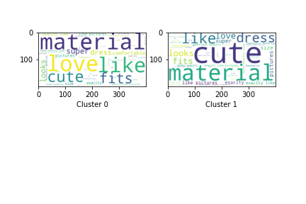

# Can You Spot Fake Reviews?
Author: Mikhaela Martin

## Zaful Reviews Analysis
While I was working part-time as a high schooler, I spent a lot of money on clothing. Most of my attire was from online clothing stores such as SheIn and YesStyle. Although it was cheap, a lot of the pieces did not end up looking like what was portrayed online. The reviews were good but it did not match reality. Although the pictures and the comments looked legitatmate, I was upset.

I started this project for myself and others who like to shop online. While the reviews may seem positive, I knew they were not. I wanted to see whether i could analyze them and spot any patterns and anomalies. Here are my results.

### Project Objectives:
1. Identify patterns on reviews that could insinuate suspicious reviewer behavior

### Images
*Most Relevant Words In Each Clusters*

*Non-Text Features Differences*

### Dataset
I webscraped Zaful Reviews from the [Floral Dresses](https://www.zaful.com/s/floral-dresses/) section of the website. These reviews were webscraped on ~September 18, 2020.

### Methods
- Cleaning Data: Random Imputation, Normalization, CountVectorizor, TFIDFVectorizor
- Modeling: Kmeans, PCA

**Why Use TFIDFVectorizor over CountVectorizor?**
First, I wanted to scale the text features from 0 to 1 because the non-text features were already normalized. Second, TFIDFVectorizor takes into account

## Challenges

1. Knowing How Many Clusters
2. Which Clusters
3. Cleaning Data

## Why bigrams and trigrams?