#  Zaful Classification Project

## Objective: Predict what factors influence a clothing item to be ranked higher

### Dataframes

#### Items:

`Rank` - order in which items are listed

`SKU` - stock keeping unit

`Item Name` - name of article of clothing

`Recommended Retail Price` - RRP

`Deals` - Viewable deal on item

`Available Colors` - list of colors item comes in including color on mainpage

`Number of Reviews` - number of customer reviews given

`True Fit Percentage` - percent of customers who say the item was true to size

`Too Small Percentage` - percent of customers who say the item was too small

`Too Large Percentage` - percent of customers who say the item was too large

`Review` - information of all ratings for product; each review includes rating given, number of pictures taken in review, comments, color/size the consumer bought, and overall fit of product

####  Reviews:

`SKU` - stock keeping unit

`Individual Rating` - Rating given out of 5 stars

`Number of Pictures` - Number of pictures taken in review

`Comment` - Comment

`Color/Size` - Color and size of clothing reviewed

`Overall Fit` - True to size


```python
import numpy as np
import pandas as pd
import matplotlib
import csv
import datetime as dt
import re

import seaborn as sns
import matplotlib.pyplot as plt
from scipy import stats

from sklearn.model_selection import train_test_split
import random

from collections import Counter

from sklearn.linear_model import LogisticRegression
from sklearn import preprocessing

import matplotlib.pyplot as plt
import seaborn as sns
from sklearn import metrics

from sklearn import tree

import pandas as pd
from sklearn.tree import DecisionTreeClassifier # Import Decision Tree Classifier
from sklearn.model_selection import train_test_split # Import train_test_split function
from sklearn import metrics #Import scikit-learn metrics module for accuracy calculation

from sklearn.cluster import KMeans
import itertools

from collections import Iterable

import nltk
from nltk.corpus import stopwords

from sklearn.feature_extraction.text import CountVectorizer
from sklearn.feature_extraction.text import TfidfTransformer

import pandas as pd
import string
import seaborn as sns
from wordcloud import WordCloud

from nltk.collocations import *
from wordcloud import WordCloud
from sklearn.linear_model import LinearRegression, Lasso, Ridge
from sklearn.metrics import mean_squared_error, mean_absolute_error
from sklearn.model_selection import cross_val_score

import random

import statsmodels.api as sm

from sklearn.metrics import classification_report
from sklearn.metrics import recall_score, f1_score,precision_recall_curve,precision_score, accuracy_score

from numpy import mean
from numpy import std
from sklearn.datasets import make_classification
from sklearn.model_selection import KFold
from sklearn.model_selection import cross_val_score
from sklearn.linear_model import LogisticRegression

from sklearn.metrics import silhouette_score
#Import scikit-learn metrics module for accuracy calculation
from sklearn import metrics
#Import svm model
from sklearn import svm
from sklearn.model_selection import GridSearchCV 
from sklearn.neighbors import KNeighborsClassifier

# numerical_reviews = ['Individual Rating', 'Number of Pictures', 'Height', 'Waist', 'Hips', 'Date (ordinal)', 'Time (numerical)']
cmap = sns.diverging_palette(220, 10, as_cmap=True)

from sklearn.model_selection import GridSearchCV

```

    <ipython-input-1-d2875e69b4d8>:34: DeprecationWarning: Using or importing the ABCs from 'collections' instead of from 'collections.abc' is deprecated since Python 3.3, and in 3.9 it will stop working
      from collections import Iterable


```python
# Setup
item_csv = r"zaful_floral_dresses_latest.csv"
items = pd.read_csv(item_csv)

reviews_csv = r"zaful_reviews_latest.csv"
reviews = pd.read_csv(reviews_csv)
```


```python
pd.set_option("display.max_rows", None, "display.max_columns", None)
```


```python
items.head()
```

### Split dataset into testing and training set


```python
# # 70% training, 30% testing
# num_dresses = len(items)
# sample_size = np.arange(1, num_dresses)

# X = items.iloc[:,1:]
# y = items.iloc[:,0:2]

# # X_items_train, X_items_test, y_items_train, y_items_test = train_test_split(X, y, test_size=0.3, random_state=42)

# X_items = X
reviews = pd.merge(reviews, items[['SKU','Rank']], how='inner', on=['SKU'])
# X_reviews = pd.merge(X_reviews, y, how='inner', on=['SKU'])# add ranking column
# # X_reviews_test = pd.merge(reviews, X_items_test, how='inner', on=['SKU']).iloc[:,0:11]
```


```python
reviews.columns
```

### Check to make sure we have all products in both tables


```python
reviews['SKU'].nunique()
```


```python
items['SKU'].nunique()
```


```python
len(items[items['Number of Reviews'].isnull()])
```


```python
# Get relevant rows
# reviews = reviews #.iloc[:,[0,1,2,3,4,5,6,7,8,9,10,-1]]

reviews.head(1)
```

# Phase 2: Cleaning the Data


## Reviews Table

### Fix `Height`, `Waist`, `Hips`, `Bust`', and `Overall Fit` values and strip unnecessary text


```python
reviews_cleaned = reviews.copy()

def clean_reviews_whhof(df):
    # Fill empty values with np.NaN
    df = df.replace('[]', ' ')
    # Rename rows - measured in cm (height, waist, hips)
    df = df.rename(columns = {'Unnamed: 7': 'Height', 'Unnamed: 8': 'Waist', 'Unnamed: 9': 'Hips', 'Unnamed: 10': 'Bust'}, inplace = False)

    # replace nan with NaN
    df = df.replace('nan',np.NaN)

    # Reorganize hips, waist, overall fit, height, bust columns
    for record in range(0,len(df)):
        # Bust is in height, rest are missing
        if df.iloc[record,6:11].isnull().sum() == 3 and not df['Height'].str.contains("Height").fillna(False)[record] :
            df.iloc[record, 7] = df.iloc[record, 6] 
            df.iloc[record, 6] = np.NaN 
        # Bust is in waist
        if df.iloc[record,6:11].isnull().sum() == 2 and df['Waist'].str.contains("Height").fillna(False)[record]:
            bust = df.iloc[record, 8] 
            df.iloc[record, 10] = bust
            df.iloc[record, 8] = np.NaN
        if df.iloc[record,6:11].isnull().sum() == 1:
            # Overall Fit missing
            if not df['Overall Fit'].str.contains("Overall Fit").fillna(False)[record]:
                df.iloc[record, 10] = df.iloc[record, 9] 
                df.iloc[record, 9] = df.iloc[record, 8]
                df.iloc[record, 8] = df.iloc[record, 7]
                df.iloc[record, 7] = df.iloc[record, 6]
                df.iloc[record, 6] = np.NaN
            # Height missing
            elif not df['Height'].str.contains("Height").fillna(False)[record]:
                df.iloc[record, 10] = df.iloc[record, 9] 
                df.iloc[record, 9] = df.iloc[record, 8]
                df.iloc[record, 8] = df.iloc[record, 7]
                df.iloc[record, 7] = np.NaN
            # Waist missing
            elif not df['Waist'].str.contains("Waist").fillna(False)[record]:
                df.iloc[record, 10] = df.iloc[record, 9] 
                df.iloc[record, 9] = df.iloc[record, 8]
                df.iloc[record, 8] = np.NaN 
            # Bust missing
            elif not df['Bust'].str.contains("Bust").fillna(False)[record]:
                df.iloc[record, 9] = df.iloc[record, 10] 
                df.iloc[record, 10] = np.NaN 
            # Hips missing
            else:
                bust = df.iloc[record, 9] 
                df.iloc[record, 10] = bust
                df.iloc[record, 9] = np.NaN

    # Extract only the numbers in centimeters
    df['Height'] = df['Height'].str.extract(r'(?<!\d)(\d{3})(?!\d)', expand=False)   
    df['Waist'] = df['Waist'].str.extract(r'(?<!\d)(\d{2})(?!\d)', expand=False)  
    df['Hips'] = df['Hips'].str.extract(r'(?<!\d)(\d{2})(?!\d)', expand=False)  
    df['Bust'] = df['Bust'].str.extract(r'(\d{2}[a-zA-Z]+)', expand=False)
    
    # Convert bust sizes to cm
    bust_conversion = {"34C": 92.5,
    "32C": 87.5,
    "34D": 95.5,
    "32D": 90,
    "34B": 90,
    "32B": 85,
    "36C": 98,
    "32AA": 76,
    "36AA": 86,
    "32A": 82.5,
    "34AA": 81,
    "36D": 101,
    "38AA": 81.5,
    "34A": 87.5,
    "36B": 95.5,
    "38C": 103,
    "36A": 92.5,
    "38B": 100.5,
    "38A": 98,
    "38D": 105.5}
    df['Bust'] = df['Bust'].replace(bust_conversion)

    # Replace Overall Fit 
    # 0 - True to Size
    # 1 - Large
    # -1 - Small
    df['Overall Fit'] = df['Overall Fit'].str.extract(r':(.*)<', expand=False).str.strip().replace({'True to Size', 'Small', 'Large'}, {0, -1, 1})
    
    return df
```

### Split `Color/Size` column into 'Color' and 'Size' columns


```python
# Separate color and size bought by customer into two columns

def reviews_clean_color_size(df):
    df['Color'] = df['Color/Size'].str.extract(r':(.*)/', expand=False)
    df['Size'] = df['Color/Size'].str.extract(r'Size:(.*)', expand=False)
    return df
```

### Add and delete columns: Split `Date Stamp` column into `Date`, `Time`, `Time (numerical)`, and `Date (ordinal)`; add `Total Colors` and `Comment Length` column


```python
def reviews_clean_date_time_color_size_comment(df):

    # Separate time and date for linear regression purposes
    df['Date (ordinal)'] = pd.to_datetime(reviews_cleaned['Date Stamp'].str.extract(r'(.*) at', expand=False)).map(dt.datetime.toordinal)
    df['Date'] = pd.to_datetime(reviews_cleaned['Date Stamp'].str.extract(r'(.*) at', expand=False))
    df['Time'] = df['Date Stamp'].str.extract(r'at (.*) [a-zA-Z]+', expand=False)

    result = []
    for i in reviews_cleaned['Time']: 
        (h, m, s) = i.split(':')
        result.append(int(h) * 3600 + int(m) * 60 + int(s))

    df['Time (numerical)']  = result

    # Delete columns that are no longer needed
    df = df.drop(columns=['Color/Size', 'Date Stamp'])

    # Number of total colors (including main)
    # reviews_cleaned['Total Colors'] = reviews_color_encode.apply(lambda x: len(x))

    # Comment Length
    df['Comment'] = df.Comment.astype(str)
    df['Comment Length'] = df['Comment'].apply(lambda x: len(x))

    # change str type to int 
    df[["Height", "Waist",'Hips', 'Bust']] = df[["Height", "Waist",'Hips', 'Bust']].apply(pd.to_numeric)
    
    # drop duplicates
    df = df.drop_duplicates()
    df = df.reset_index()
    
    return df
```

### Clean `Reviews` table


```python
reviews_cleaned = clean_reviews_whhof(reviews_cleaned)
```


```python
reviews_cleaned = reviews_clean_color_size(reviews_cleaned)
```


```python
reviews_cleaned = reviews_clean_date_time_color_size_comment(reviews_cleaned)
```


```python
reviews_cleaned = reviews_cleaned.drop('index', axis=1)
```


```python
reviews_cleaned.head(1)
```


```python
reviews_cleaned.describe()
```

### Observations

We see that the individual ratings are highly skewed and the majority of number of pictures posted is 0. Also, the overall fit leans towards true to size. The height, waist, and hips seem very skewed; maybe there are false reviews or default options were filled in. The ranks column seems skewed right so the majority of comments are coming from higher ranked clothing items. The date and time seem very spread out and the comment length trails off the longer the comment is.


```python
reviews_cleaned.corr()
```


```python
# numerical_reviews = ['Individual Rating', 'Number of Pictures', 'Height', 'Waist', 'Hips', 'Date (ordinal)', 'Time (numerical)']
cmap = sns.diverging_palette(220, 10, as_cmap=True)

# Draw the heatmap with the mask and correct aspect ratio
sns.heatmap(reviews_cleaned.corr(), cmap=cmap, vmax=.3, center=0,
            square=True, linewidths=.5, cbar_kws={"shrink": .5})
```

### Observations

SKU and date are moderately positively correlated probably because recent dates have a higher SKU. The number of pictures seems to have a positive correlation between height and waist so people with a bigger size post more pictures. Individual rating and overall fit have a negative correlation so the higher the rating, the smaller the fit. Waist and height have the highest correlation. Date and rank have a negative correlation with each other so reviews that date further back have a lower ranking (number gets bigger the lower the ranking). Comment length and number of pictures seems to have a stronger positive correlation with each other so the more the pictures, the longer the comment.

### Rank Observations: 
Rank seems to have a negative relationship with almost every feature so that means reviews with higher ratings, pictures, height, waist, hips, date, and comment length have a better ranking (number gets smaller).


```python
pd.set_option("display.max_rows", None, "display.max_columns", None)
```

## Figure out what to do with missing values


```python
# Check missing values

for i in range(1,11):
    if i != 3:
        print(reviews_cleaned.columns[i])
        print(reviews_cleaned.iloc[:,i].value_counts())
        print(reviews_cleaned.iloc[:,i].isna().sum(), " missing values")
        print()

```


```python
for i in range(0, len(reviews_cleaned.columns)):
    print("%s: %d missing values" % (reviews_cleaned.columns[i],reviews_cleaned.iloc[:,i].isna().sum()))
    
print(len(reviews_cleaned), " total reviews")
```

## Figuring out what to do with spam reviews


```python
comments_list = reviews_cleaned.iloc[:,3].value_counts()
nonunique_comments_list = comments_list[comments_list > 1] # non-unique
print(nonunique_comments_list)
print(nonunique_comments_list.values.sum(), " non-unique comments")
```


```python
# 1 means there's only one copy of that comment; >1 number of non-unique comments
comments_list.groupby(np.where(comments_list.values > 1, '>1', comments_list.values)).sum()
```

### Add `non-unique` column that labels non-unique comments as 1, 0 otherwise


```python
# Split comments into spam and nonspam depending on whether comment has been repeated or is unique
# 441 non-unique categories, 3

reviews_cleaned['non_unique'] = [1 if i in nonunique_comments_list else 0 for i in reviews_cleaned.iloc[:,3]]
```


```python
# from nltk.tokenize import sent_tokenize, word_tokenize

# comment_tokenize = reviews_cleaned[['Comment']]
# #ex = 'Hello Mr. Smith, how are you today? I am doing well; thank you.'
# # sent_tokenize(ex)
# comment_tokenize['tokenized comment'] = comment_tokenize['Comment'].apply(word_tokenize)
# #sent_tokenize(comment_tokenize.values)
```

### Add `in_bigram` column that labels comments with frequent phrases as 1, 0 otherwise


```python
# find most common words in spam list
bigram_measures = nltk.collocations.BigramAssocMeasures()
trigram_measures = nltk.collocations.TrigramAssocMeasures()
pairs = nltk.bigrams(reviews_cleaned[reviews_cleaned['non_unique'] == 0]['Comment'])
# change this to read in your data
finder = nltk.collocations.BigramCollocationFinder.from_words(reviews_cleaned[reviews_cleaned['non_unique'] == 1]['Comment'])

# only bigrams that appear 3+ times
finder.apply_freq_filter(2)

# return the 10 n-grams with the highest PMI
# finder.nbest(bigram_measures.pmi,200)
```


```python
def Extract(lst):
    return [item[0] for item in lst]

bigram_phrases = Extract(finder.nbest(bigram_measures.pmi,200))
len(bigram_phrases)
```


```python
reviews_cleaned['in_bigram'] = [0] * len(reviews_cleaned)

for j in bigram_phrases:
    for i in range(len(reviews_cleaned)):
        if j in reviews_cleaned.loc[i, 'Comment']:
            reviews_cleaned.loc[i, 'in_bigram'] = 1
            continue
# reviews_cleaned['in_bigram'] = [1 if any(j in i) for j in bigram_phrases for i in reviews_cleaned['Comment']]

```


```python
# check if any spam comments don't have bigram phrase

len(reviews_cleaned[reviews_cleaned['non_unique'] != reviews_cleaned['in_bigram']])
```


```python
# check if any nonspam comments are in bigram phrase

len(reviews_cleaned[(reviews_cleaned['non_unique'] == 0) & (reviews_cleaned['in_bigram'] == 1)])
```


```python
len(reviews_cleaned[(reviews_cleaned['non_unique'] == 1) & (reviews_cleaned['in_bigram'] == 0)])
```


```python
reviews_cleaned[(reviews_cleaned['non_unique'] == 1) & (reviews_cleaned['Number of Pictures'] != 0)].head(50)
```

### Add `spam` column that denotes labels review as spam if non-unique = 1 or in_bigram = 1, 0 otherwise


```python
reviews_cleaned['spam'] = [1 if (reviews_cleaned.loc[i,'non_unique'] == 1 or reviews_cleaned.loc[i,'in_bigram'] == 1) else 0 for i in range(len(reviews_cleaned))]
```


```python
reviews_cleaned.head(1)
```

### Average counts for spam and non-spam


```python
spam_avg = pd.pivot_table(reviews_cleaned,index=["spam"])
spam_avg
```

Spam emails have a lower average comment length than non-spam. Suprisingly, the mean dates are very similar. The individual ratings for spam are a little higher and the mean number of pictures for spam are a little lower. The ranks are very similar


```python
for i in spam_avg.columns:
    not_spam = reviews_cleaned[reviews_cleaned['spam'] == 0][i]
    spam = reviews_cleaned[reviews_cleaned['spam'] == 1][i]
    sns.distplot(not_spam, kde=False)
    sns.distplot(spam, kde=False)
    plt.ylabel('Count')
    plt.legend(labels=['not spam', 'spam'])
    
    plt.show()
```


```python
sns.distplot(reviews_cleaned.loc[:,'Date (ordinal)'])
```


    <matplotlib.axes._subplots.AxesSubplot at 0x7f831560f100>


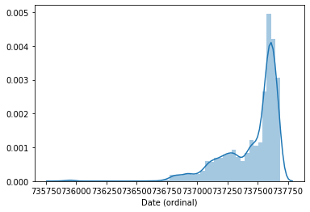


Insert observations

### Figuring out why there are so many outliers in height and seeing if there is a correlation between height and spam


```python
# Looking at reviews with height < 140 which should be spam
# I suspect that they were either not given the option to input height/waist (very small numbers) nor hips/bust (NaN) and/or were assigned after reviewing

reviews_cleaned[(reviews_cleaned['Height'] < 140) & (reviews_cleaned['spam'] == 0)].tail(50)
```

no . Therefore, want to classify spam comments only through comments and no other features.


```python
reviews_cleaned[(reviews_cleaned['Individual Rating'] < 4)]
```

### Dealing with missing data

Is data missing completely at random? No, because...

## Items Table


```python
items.head()
```


```python
num_dresses = len(items)
```

### Separate `Item Name` column into three columns and format percentages to floats


```python
# Make copy of items into new items_cleaned table
items_cleaned = items.copy()

def clean_items(df):

    # Separate Item Name column into three columns: Item Name, Color 0, and Size 0 
    df['Color 0'] = df['Item Name'].str.extract(r'- (.*) [a-zA-Z ]+', expand=False) 
    df['Size 0'] = df['Item Name'].str.extract(r'- [a-zA-Z- ]+ (.*)', expand=False) 
    df['Item Name'] = df['Item Name'].str.extract(r'(.*) -', expand=False) 

    # Change type for percentages to floats 
    df['True Fit Percentage'] = df['True Fit Percentage'].str.extract(r'(\d+\.\d+)', expand=False).astype(float) 
    df['Too Small Percentage'] = df['Too Small Percentage'].str.extract(r'(\d+\.\d+)', expand=False).astype(float) 
    df['Too Large Percentage'] = df['Too Large Percentage'].str.extract(r'(\d+\.\d+)', expand=False).astype(float) 
    
    df['Available Colors'] = df['Available Colors'].str.extract(r'\;(.*)')
    df['Available Colors'] = df['Available Colors']
    # df['Available Colors'] = df['Color 0'] + '; ' + df['Available Colors']

    # replace NaN values in 'Number of Reviews' to 0
    df['Number of Reviews'] = df['Number of Reviews'].replace({np.NaN : 0})
    
    # item name length
    df['Item Name Length'] = df['Item Name'].str.split().str.len()
    
    # Rank variable
    df = df.reset_index()
    df['Rank'] = df['index'] + 1
    df = df.drop('index', axis=1)
    
    # divide ranks into three 'scroll' categories
    df['scroll'] = [5] * len(df)

    for i in range(0, len(df)):
        if df.loc[i, 'Rank'] < (num_dresses / 5):
            df.loc[i, 'scroll'] = 1
        elif df.loc[i, 'Rank'] < (num_dresses * 2 / 5):
            df.loc[i, 'scroll'] = 2
        elif df.loc[i, 'Rank'] < (num_dresses * 3 / 5):
            df.loc[i, 'scroll'] = 3
        elif df.loc[i, 'Rank'] < (num_dresses * 4 / 5):
            df.loc[i, 'scroll'] = 4

        
     # divide ranks into three 'scroll' categories
    df['page'] = [5] * len(df)

    for i in range(0, len(df)):
        if df.loc[i, 'Rank'] < 120:
            df.loc[i, 'page'] = 1
        elif df.loc[i, 'Rank'] < 240:
            df.loc[i, 'page'] = 2
        elif df.loc[i, 'Rank'] < 360:
            df.loc[i, 'page'] = 3
        elif df.loc[i, 'Rank'] < 480:
            df.loc[i, 'page'] = 4

            
    # divide ranks into three 'scroll' categories
    df['SKU group'] = [3] * len(df)

    for i in range(0, len(df)):
        if df.loc[i, 'SKU'] < 300000000:
            df.loc[i, 'SKU group'] = 1
        elif df.loc[i, 'SKU'] < 430000000:
            df.loc[i, 'SKU group'] = 2

    # number of available colors (includes primary color)
    df['Number of Available Colors'] = [1] * len(df)

    for i in range(0, len(df)):
        if isinstance(df.loc[i, 'Available Colors'], str):
            df.loc[i, 'Number of Available Colors'] = df.loc[i,'Available Colors'].count(';') + 2
            
    # Add price difference column between RRP and Shop Price
    df['price_diff'] = df['Recommended Retail Price'].sub(df['Shop Price'], axis = 0) 
    # Create column that distinguishes RRPs less than $40, those usually don't appear in the beginning ranks
    df['rrp<40'] = [1 if i < 40 else 0 for i in df['Recommended Retail Price']]
    
    #df = pd.get_dummies(df,columns=['Size 0'], prefix='size',drop_first=True)

    return df
```


```python
items_cleaned = clean_items(items_cleaned)
items_cleaned.head(10)
```


```python
items_cleaned[items_cleaned['Size 0'] == '3xl']
```


```python
pd.options.display.max_colwidth = 300
```

Fix issues


```python
issue_rank = items_cleaned[items_cleaned['Size 0'].str.contains('Purple')]['Rank'].values[0]
```


```python
items_cleaned[items_cleaned['Size 0'].str.contains('Purple')]
```


```python
# Solve problems
items_cleaned.iloc[issue_rank, items_cleaned.columns.get_loc('Color 0')] = 'Light Purple'
items_cleaned.iloc[issue_rank, items_cleaned.columns.get_loc('Size 0')] =  'None'
# items_cleaned[items_cleaned['Size 0'].str.contains('Purple')]['Size 0'] = np.NaN
```


```python
cols = [3,4,5,6,7,8,9,10,11,12,13,14]

for i in cols:  
    print(items_cleaned.columns[i])
    print(items_cleaned.iloc[:,i].value_counts())
    print(items_cleaned.iloc[:,i].isna().sum(), " missing values")
    print()
```


```python
items_cleaned[items_cleaned.isnull().any(axis=1)].head()

# missing values only pertain to items with 0 reviews
```

# Phase 3: Exploratory Data Analysis


```python
items_cleaned.head(1)
```

## Reviews


```python
reviews_cleaned['Rank'].values
```


    array([ 1,  1,  1, ..., 39, 39, 39])


```python
# Draw the heatmap with the mask and correct aspect ratio
sns.heatmap(reviews_cleaned.corr(), cmap=cmap, vmax=.3, center=0,
            square=True, linewidths=.5, cbar_kws={"shrink": .5})
```


    <matplotlib.axes._subplots.AxesSubplot at 0x7f837137d730>


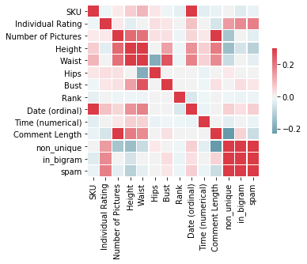


```python
reviews_cleaned.corr()
```


<div>
<style scoped>
    .dataframe tbody tr th:only-of-type {
        vertical-align: middle;
    }

    .dataframe tbody tr th {
        vertical-align: top;
    }

    .dataframe thead th {
        text-align: right;
    }
</style>
<table border="1" class="dataframe">
  <thead>
    <tr style="text-align: right;">
      <th></th>
      <th>SKU</th>
      <th>Individual Rating</th>
      <th>Number of Pictures</th>
      <th>Height</th>
      <th>Waist</th>
      <th>Hips</th>
      <th>Bust</th>
      <th>Rank</th>
      <th>Date (ordinal)</th>
      <th>Time (numerical)</th>
      <th>Comment Length</th>
      <th>non_unique</th>
      <th>in_bigram</th>
      <th>spam</th>
    </tr>
  </thead>
  <tbody>
    <tr>
      <th>SKU</th>
      <td>1.000000</td>
      <td>-0.010617</td>
      <td>0.012518</td>
      <td>0.059401</td>
      <td>0.096353</td>
      <td>0.019697</td>
      <td>-0.010827</td>
      <td>-0.024508</td>
      <td>0.619777</td>
      <td>-0.031199</td>
      <td>-0.020487</td>
      <td>0.003083</td>
      <td>-0.037570</td>
      <td>-0.019393</td>
    </tr>
    <tr>
      <th>Individual Rating</th>
      <td>-0.010617</td>
      <td>1.000000</td>
      <td>0.016097</td>
      <td>-0.029424</td>
      <td>-0.001982</td>
      <td>0.032201</td>
      <td>0.018649</td>
      <td>-0.001605</td>
      <td>0.077874</td>
      <td>0.002763</td>
      <td>-0.051317</td>
      <td>0.139607</td>
      <td>0.169860</td>
      <td>0.187322</td>
    </tr>
    <tr>
      <th>Number of Pictures</th>
      <td>0.012518</td>
      <td>0.016097</td>
      <td>1.000000</td>
      <td>0.224006</td>
      <td>0.208548</td>
      <td>0.031021</td>
      <td>0.030424</td>
      <td>-0.016512</td>
      <td>0.044066</td>
      <td>0.017845</td>
      <td>0.303684</td>
      <td>-0.127835</td>
      <td>0.011678</td>
      <td>-0.033042</td>
    </tr>
    <tr>
      <th>Height</th>
      <td>0.059401</td>
      <td>-0.029424</td>
      <td>0.224006</td>
      <td>1.000000</td>
      <td>0.652196</td>
      <td>0.010617</td>
      <td>0.132912</td>
      <td>-0.013396</td>
      <td>0.154629</td>
      <td>0.058167</td>
      <td>0.191809</td>
      <td>-0.144321</td>
      <td>-0.056505</td>
      <td>-0.098601</td>
    </tr>
    <tr>
      <th>Waist</th>
      <td>0.096353</td>
      <td>-0.001982</td>
      <td>0.208548</td>
      <td>0.652196</td>
      <td>1.000000</td>
      <td>-0.183774</td>
      <td>0.254983</td>
      <td>-0.015575</td>
      <td>0.181484</td>
      <td>0.052774</td>
      <td>0.168580</td>
      <td>-0.074141</td>
      <td>0.000729</td>
      <td>-0.026914</td>
    </tr>
    <tr>
      <th>Hips</th>
      <td>0.019697</td>
      <td>0.032201</td>
      <td>0.031021</td>
      <td>0.010617</td>
      <td>-0.183774</td>
      <td>1.000000</td>
      <td>-0.004717</td>
      <td>-0.005613</td>
      <td>0.003930</td>
      <td>-0.020855</td>
      <td>-0.009552</td>
      <td>0.015346</td>
      <td>0.009655</td>
      <td>0.001842</td>
    </tr>
    <tr>
      <th>Bust</th>
      <td>-0.010827</td>
      <td>0.018649</td>
      <td>0.030424</td>
      <td>0.132912</td>
      <td>0.254983</td>
      <td>-0.004717</td>
      <td>1.000000</td>
      <td>-0.005440</td>
      <td>0.008110</td>
      <td>-0.013813</td>
      <td>0.029581</td>
      <td>-0.009123</td>
      <td>0.035099</td>
      <td>0.019297</td>
    </tr>
    <tr>
      <th>Rank</th>
      <td>-0.024508</td>
      <td>-0.001605</td>
      <td>-0.016512</td>
      <td>-0.013396</td>
      <td>-0.015575</td>
      <td>-0.005613</td>
      <td>-0.005440</td>
      <td>1.000000</td>
      <td>-0.044335</td>
      <td>-0.013345</td>
      <td>-0.009674</td>
      <td>-0.010941</td>
      <td>-0.018936</td>
      <td>-0.016315</td>
    </tr>
    <tr>
      <th>Date (ordinal)</th>
      <td>0.619777</td>
      <td>0.077874</td>
      <td>0.044066</td>
      <td>0.154629</td>
      <td>0.181484</td>
      <td>0.003930</td>
      <td>0.008110</td>
      <td>-0.044335</td>
      <td>1.000000</td>
      <td>-0.018535</td>
      <td>0.011757</td>
      <td>0.054183</td>
      <td>0.033085</td>
      <td>0.056301</td>
    </tr>
    <tr>
      <th>Time (numerical)</th>
      <td>-0.031199</td>
      <td>0.002763</td>
      <td>0.017845</td>
      <td>0.058167</td>
      <td>0.052774</td>
      <td>-0.020855</td>
      <td>-0.013813</td>
      <td>-0.013345</td>
      <td>-0.018535</td>
      <td>1.000000</td>
      <td>0.011212</td>
      <td>-0.030833</td>
      <td>-0.009832</td>
      <td>-0.017767</td>
    </tr>
    <tr>
      <th>Comment Length</th>
      <td>-0.020487</td>
      <td>-0.051317</td>
      <td>0.303684</td>
      <td>0.191809</td>
      <td>0.168580</td>
      <td>-0.009552</td>
      <td>0.029581</td>
      <td>-0.009674</td>
      <td>0.011757</td>
      <td>0.011212</td>
      <td>1.000000</td>
      <td>-0.233645</td>
      <td>0.051558</td>
      <td>-0.072732</td>
    </tr>
    <tr>
      <th>non_unique</th>
      <td>0.003083</td>
      <td>0.139607</td>
      <td>-0.127835</td>
      <td>-0.144321</td>
      <td>-0.074141</td>
      <td>0.015346</td>
      <td>-0.009123</td>
      <td>-0.010941</td>
      <td>0.054183</td>
      <td>-0.030833</td>
      <td>-0.233645</td>
      <td>1.000000</td>
      <td>0.419637</td>
      <td>0.637958</td>
    </tr>
    <tr>
      <th>in_bigram</th>
      <td>-0.037570</td>
      <td>0.169860</td>
      <td>0.011678</td>
      <td>-0.056505</td>
      <td>0.000729</td>
      <td>0.009655</td>
      <td>0.035099</td>
      <td>-0.018936</td>
      <td>0.033085</td>
      <td>-0.009832</td>
      <td>0.051558</td>
      <td>0.419637</td>
      <td>1.000000</td>
      <td>0.855698</td>
    </tr>
    <tr>
      <th>spam</th>
      <td>-0.019393</td>
      <td>0.187322</td>
      <td>-0.033042</td>
      <td>-0.098601</td>
      <td>-0.026914</td>
      <td>0.001842</td>
      <td>0.019297</td>
      <td>-0.016315</td>
      <td>0.056301</td>
      <td>-0.017767</td>
      <td>-0.072732</td>
      <td>0.637958</td>
      <td>0.855698</td>
      <td>1.000000</td>
    </tr>
  </tbody>
</table>
</div>


```python

```


```python
reviews_scroll = pd.merge(reviews_cleaned,spam_percent[['SKU','scroll']], on='SKU')
pg1 = reviews_scroll[reviews_scroll['scroll'] == 1]['SKU']
pg2 = reviews_scroll[reviews_scroll['scroll'] == 2]['SKU']
pg3 = reviews_scroll[reviews_scroll['scroll'] == 3]['SKU']
pg4 = reviews_scroll[reviews_scroll['scroll'] == 4]['SKU']
pg5 = reviews_scroll[reviews_scroll['scroll'] == 5]['SKU']
sns.distplot(pg1, kde=False)
sns.distplot(pg2, kde=False)
sns.distplot(pg3, kde=False)
sns.distplot(pg4, kde=False)
sns.distplot(pg5, kde=False)
plt.ylabel('Count')
plt.legend(labels=['1', '2','3','4','5'])
```


    <matplotlib.legend.Legend at 0x7f830c68c400>


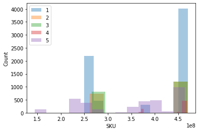


```python
reviews_scroll = pd.merge(reviews_cleaned,spam_percent[['SKU','scroll']], on='SKU')
pg1 = reviews_scroll[reviews_scroll['scroll'] == 1]['SKU']
pg2 = reviews_scroll[reviews_scroll['scroll'] == 2]['SKU']
pg3 = reviews_scroll[reviews_scroll['scroll'] == 3]['SKU']
pg4 = reviews_scroll[reviews_scroll['scroll'] == 4]['SKU']
pg5 = reviews_scroll[reviews_scroll['scroll'] == 5]['SKU']
sns.distplot(pg1, kde=False)
sns.distplot(pg2, kde=False)
sns.distplot(pg3, kde=False)
sns.distplot(pg4, kde=False)
sns.distplot(pg5, kde=False)
plt.ylabel('Count')
plt.legend(labels=['1', '2','3','4','5'])
pg1 = reviews_scroll[reviews_scroll['scroll'] == 1]['Date (ordinal)']
pg2 = reviews_scroll[reviews_scroll['scroll'] == 2]['Date (ordinal)']
pg3 = reviews_scroll[reviews_scroll['scroll'] == 3]['Date (ordinal)']
pg4 = reviews_scroll[reviews_scroll['scroll'] == 4]['Date (ordinal)']
pg5 = reviews_scroll[reviews_scroll['scroll'] == 5]['Date (ordinal)']
sns.distplot(pg1, kde=False)
sns.distplot(pg2, kde=False)
sns.distplot(pg3, kde=False)
sns.distplot(pg4, kde=False)
sns.distplot(pg5, kde=False)
plt.ylabel('Count')
plt.legend(labels=['1', '2','3','4','5'])
sns.distplot(pg2, kde=False)
sns.distplot(pg3, kde=False)
plt.legend(labels=['2','3'])
sns.distplot(pg4, kde=False)
sns.distplot(pg5, kde=False)
plt.legend(labels=['4','5'])
```


    <matplotlib.legend.Legend at 0x7f830c6d9130>


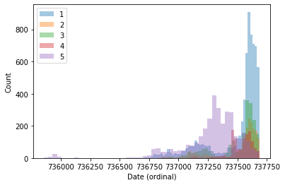


```python
sns.distplot(pg2, kde=False)
sns.distplot(pg3, kde=False)
plt.legend(labels=['2','3'])
```


    <matplotlib.legend.Legend at 0x7f8307d1ac70>


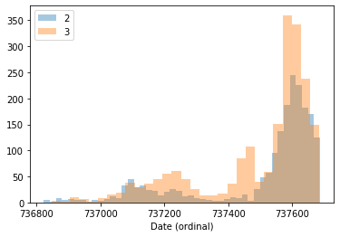


```python
sns.distplot(pg4, kde=False)
sns.distplot(pg5, kde=False)
plt.legend(labels=['4','5'])
```


    <matplotlib.legend.Legend at 0x7f8307c693a0>


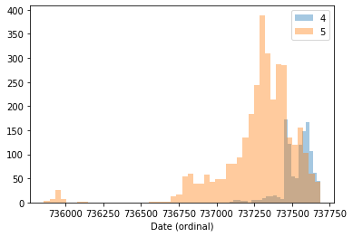


## Rank Plots


```python
sku_plts = ['Date (ordinal)','Comment Length','Number of Pictures']
for i in sku_plts:
    sns.relplot(x='Rank', y=i,hue='Rank', data=reviews_cleaned)
    plt.show()
```


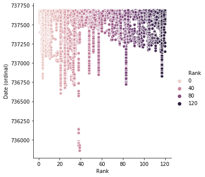


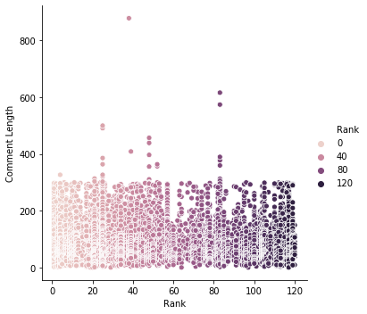


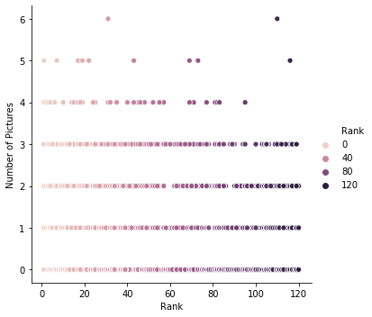


# Create 'spam_percent' table 


```python
reviews_cleaned.describe()
```


```python
sku_spam = reviews_cleaned.groupby(['SKU']).sum()[['spam']] # number of spam
sku_count = reviews_cleaned.groupby(['SKU']).count()[['Rank']] # number of items
sku_date = reviews_cleaned.groupby(['SKU']).median()[['Date (ordinal)']] # median date
sku_time = reviews_cleaned.groupby(['SKU']).median()[['Time (numerical)']] # median time
sku_comlen = reviews_cleaned.groupby(['SKU']).median()[['Comment Length']] # median comment length
sku_pics_count = reviews_cleaned.groupby(['SKU']).sum()[['Number of Pictures']] # number of pictures
sku_pics_med = reviews_cleaned.groupby(['SKU']).median()[['Number of Pictures']] # median number of pictures

spam_percent = pd.DataFrame()
spam_percent = pd.merge(sku_spam,sku_count, on='SKU')
spam_percent = pd.merge(spam_percent, sku_date, on='SKU')
spam_percent = pd.merge(spam_percent, sku_time, on='SKU')
spam_percent = pd.merge(spam_percent, sku_comlen, on='SKU')
spam_percent = pd.merge(spam_percent, sku_pics_med, on ='SKU')
spam_percent = pd.merge(spam_percent, sku_pics_count, on ='SKU')

spam_percent = spam_percent.rename({'Comment Length': 'Median Comment Length','Rank': 'Number of Comments', 'Date (ordinal)' : 'Median Comment Date', 'Number of Pictures_x' : 'Median Number of Pictures', 'Number of Pictures_y' : 'Total Pictures'}, axis='columns')

spam_percent['Spam Percent'] = spam_percent['spam'] / spam_percent['Number of Comments']
spam_percent = pd.merge(spam_percent, items_cleaned[['Rank','SKU','scroll','page']], on='SKU')
```


```python
sku_mean_date = reviews_cleaned.groupby(['SKU']).mean()[['Date (ordinal)']]
spam_percent = pd.merge(spam_percent, sku_mean_date, on ='SKU')
spam_percent = spam_percent.rename({'Date (ordinal)': 'Mean Comment Date'},axis='columns')

sku_25_date = reviews_cleaned.groupby(['SKU']).quantile(.25)[['Date (ordinal)']] 
spam_percent = pd.merge(spam_percent, sku_25_date, on ='SKU')
spam_percent = spam_percent.rename({'Date (ordinal)': '25th Comment Date'},axis='columns')

sku_75_date = reviews_cleaned.groupby(['SKU']).quantile(.75)[['Date (ordinal)']] 
spam_percent = pd.merge(spam_percent, sku_75_date, on ='SKU')
spam_percent = spam_percent.rename({'Date (ordinal)': '75th Comment Date'},axis='columns')

sku_min_date = reviews_cleaned.groupby(['SKU']).quantile(0)[['Date (ordinal)']] 
spam_percent = pd.merge(spam_percent, sku_min_date, on ='SKU')
spam_percent = spam_percent.rename({'Date (ordinal)': 'Min Comment Date'},axis='columns')

sku_max_date = reviews_cleaned.groupby(['SKU']).quantile(1)[['Date (ordinal)']] 
spam_percent = pd.merge(spam_percent, sku_max_date, on ='SKU')
spam_percent = spam_percent.rename({'Date (ordinal)': 'Max Comment Date'},axis='columns')

spam_percent['Range Date'] = spam_percent['Max Comment Date'] - spam_percent['Min Comment Date']
spam_percent['IQR Date'] = spam_percent['75th Comment Date'] - spam_percent['25th Comment Date']
```


```python
spam_percent.head()
```


```python
spam_percent.corr()
```

# SAVE FILES


```python
#items_cleaned.to_csv (r'items_cleaned_2.csv', index=False)
#reviews_cleaned.to_csv (r'reviews_cleaned_2.csv', index=False)
#spam_percent.to_csv (r'spam_percent_2.csv', index=False)

spam_percent = pd.read_csv(r'spam_percent_2.csv')
items_cleaned = pd.read_csv(r'items_cleaned_2.csv')
reviews_cleaned = pd.read_csv(r'reviews_cleaned_2.csv')
```


```python
spam_percent.columns
```


```python
items_cleaned.corr().abs().sort_values(by='page', axis=0, ascending=False).loc[:,'page'][3:10].index
```


```python
spam_percent.corr().abs().sort_values(by='page', axis=0, ascending=False).loc[:,'page'][3:10].index
```


```python
sns.relplot(x='page', y='Median Comment Date',hue='page', data=spam_percent)
```


```python
sns.relplot(x='scroll', y='Median Comment Date',hue='scroll', data=spam_percent)
```


    <seaborn.axisgrid.FacetGrid at 0x7f8315f7f8b0>


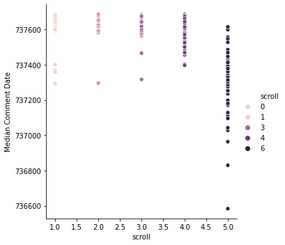


## SKU Plots


```python
sku_plts = ['spam', 'Number of Comments','Median Comment Date','Spam Percent','Rank','Total Pictures']
for i in sku_plts:
    sns.relplot(x='SKU', y=i,hue='scroll', data=spam_percent)
    plt.show()
```

### spam_percent: SKU v. Number of Comments


```python
X = spam_percent[['SKU', 'Number of Comments']]
kmeans1 = KMeans(n_clusters=4).fit(X)
y_kmeans = kmeans1.predict(X)

plt.scatter(X.iloc[:, 0], X.iloc[:, 1], c=y_kmeans, s=50, cmap=cmap)

centers = kmeans1.cluster_centers_
plt.scatter(centers[:, 0], centers[:, 1], c='black', s=200, alpha=0.5)

corrs = []
spam_percent['sku_com'] = kmeans1.labels_
```


```python

cost =[] 
for i in range(1, 11): 
    kmeans = KMeans(n_clusters=i, random_state=0)
    kmeans.fit(X)
      
    # calculates squared error 
    # for the clustered points 
    cost.append(kmeans.inertia_)      
  
# plot the cost against K values 
plt.plot(range(1, 11), cost, color ='g', linewidth ='3') 
plt.xlabel("Value of K") 
plt.ylabel("Sqaured Error (Cost)") 
plt.show() # clear the plot 

sil = []
kmax = 10

# dissimilarity would not be defined for a single cluster, thus, minimum number of clusters should be 2
for k in range(2, kmax+1):
  kmeans = KMeans(n_clusters = k).fit(X)
  labels = kmeans.labels_
  sil.append(silhouette_score(X, labels, metric = 'euclidean'))

# plot the cost against K values 
plt.plot(range(2, 11), sil, color ='g', linewidth ='3') 
plt.xlabel("Value of K") 
plt.ylabel("Silhouette score") 
plt.show() # clear the plot 
```


```python
# from sklearn.cluster import AgglomerativeClustering
# import scipy.cluster.hierarchy as shc

# plt.figure(figsize=(10, 7))
# plt.title("Customer Dendograms")
# dend = shc.dendrogram(shc.linkage(X, method='ward'))
# cluster = AgglomerativeClustering(n_clusters=10, affinity='euclidean', linkage='ward')
# cluster.fit_predict(X)
# # plt.scatter(X.iloc[:,0],X.iloc[:,1], c=cluster.labels_, cmap='rainbow')
```


```python
# corrs = []
# X = spam_percent[['Total Pictures','SKU']]

# # dissimilarity would not be defined for a single cluster, thus, minimum number of clusters should be 2
# for k in range(3, 11):
#     kmeans = KMeans(n_clusters=k).fit(X)
#     spam_percent['sku_pics'] = kmeans.labels_
#     corrs.append(spam_percent[['sku_pics', 'page']].corr().loc['page','sku_pics'])

# # plot the cost against K values 
# plt.plot(range(3, 11), corrs, color ='g', linewidth ='3') 
# plt.xlabel("clusters") 
# plt.ylabel("correlation") 
# plt.show() # clear the plot 
```


```python
spam_percent = pd.get_dummies(spam_percent,columns=['sku_com'], prefix='sku_com', drop_first=True)
```

### spam_percent: SKU v. Total Pictures


```python
sns.relplot(x='SKU', y='Total Pictures',hue='page', data=spam_percent)
plt.show()
X = spam_percent[['SKU', 'Total Pictures']]
kmeans2 = KMeans(n_clusters=4, random_state=0).fit(X)
y_kmeans = kmeans2.predict(X)

plt.scatter(X.iloc[:, 0], X.iloc[:, 1], c=y_kmeans, s=50, cmap=cmap)

centers = kmeans2.cluster_centers_
plt.scatter(centers[:, 0], centers[:, 1], c='black', s=200, alpha=0.5)
```


```python

cost =[] 
for i in range(1, 11): 
    kmeans = KMeans(n_clusters=i, random_state=0)
    kmeans.fit(X)
      
    # calculates squared error 
    # for the clustered points 
    cost.append(kmeans.inertia_)      
  
# plot the cost against K values 
plt.plot(range(1, 11), cost, color ='g', linewidth ='3') 
plt.xlabel("Value of K") 
plt.ylabel("Sqaured Error (Cost)") 
plt.show() # clear the plot 

sil = []
kmax = 10

# dissimilarity would not be defined for a single cluster, thus, minimum number of clusters should be 2
for k in range(2, kmax+1):
  kmeans = KMeans(n_clusters = k).fit(X)
  labels = kmeans.labels_
  sil.append(silhouette_score(X, labels, metric = 'euclidean'))

# plot the cost against K values 
plt.plot(range(2, 11), sil, color ='g', linewidth ='3') 
plt.xlabel("Value of K") 
plt.ylabel("Silhouette score") 
plt.show() # clear the plot 
```


```python
# accuracy = []
# precision = []
# X = spam_percent[['Total Pictures','SKU']]

# # dissimilarity would not be defined for a single cluster, thus, minimum number of clusters should be 2
# for k in range(3, 11):
#     kmeans = KMeans(n_clusters=k).fit(X)
#     spam_percent['sku_pics'] = kmeans.labels_
#     #corrs.append(spam_percent[['sku_pics', 'page']].corr().loc['page','sku_pics'])
#     accuracy.append(accuracy_score(spam_percent['sku_pics'], spam_percent['page']))
#     precision.append(precision_score(spam_percent['sku_pics'], spam_percent['page'], average='weighted'))

# # plot the cost against K values 
# plt.plot(range(3, 11), precision, color ='g', linewidth ='3') 
# plt.xlabel("clusters") 
# plt.ylabel("precision") 
# plt.show() # clear the plot 


# # plot the cost against K values 
# plt.plot(range(3, 11), accuracy, color ='g', linewidth ='3') 
# plt.xlabel("clusters") 
# plt.ylabel("accuracy") 
# plt.show() # clear the plot 
```


```python
spam_percent['sku_pics'] = kmeans2.labels_
```


```python
spam_percent = pd.get_dummies(spam_percent, columns=['sku_pics'], prefix='sku_pics', drop_first=True)

```

### spam_percent: SKU v. Median Comment Date


```python
sns.relplot(x='SKU', y='Median Comment Date',hue='page', data=spam_percent)
plt.show()
X = spam_percent[['SKU', 'Median Comment Date']]
kmeans3 = KMeans(n_clusters=4, random_state=0).fit(X)
y_kmeans = kmeans3.predict(X)

plt.scatter(X.iloc[:, 0], X.iloc[:, 1], c=y_kmeans, s=50, cmap=cmap)

centers = kmeans3.cluster_centers_
plt.scatter(centers[:, 0], centers[:, 1], c='black', s=200, alpha=0.5)
```


```python

cost =[] 
for i in range(1, 11): 
    kmeans = KMeans(n_clusters=i, random_state=0)
    kmeans.fit(X)
      
    # calculates squared error 
    # for the clustered points 
    cost.append(kmeans.inertia_)      
  
# plot the cost against K values 
plt.plot(range(1, 11), cost, color ='g', linewidth ='3') 
plt.xlabel("Value of K") 
plt.ylabel("Sqaured Error (Cost)") 
plt.show() # clear the plot 

sil = []
kmax = 10

# dissimilarity would not be defined for a single cluster, thus, minimum number of clusters should be 2
for k in range(2, kmax+1):
  kmeans = KMeans(n_clusters = k).fit(X)
  labels = kmeans.labels_
  sil.append(silhouette_score(X, labels, metric = 'euclidean'))

# plot the cost against K values 
plt.plot(range(2, 11), sil, color ='g', linewidth ='3') 
plt.xlabel("Value of K") 
plt.ylabel("Silhouette score") 
plt.show() # clear the plot 
```


```python
spam_percent['sku_medcom'] = kmeans3.labels_
```


```python
spam_percent = pd.get_dummies(spam_percent, columns=['sku_medcom'], prefix='sku_medcom', drop_first=True)
```


```python
spam_percent.columns
```

### spam_percent: SKU v. Spam Percent


```python
sns.relplot(x='SKU', y='Spam Percent',hue='page', data=spam_percent)
plt.show()
X = spam_percent[['SKU', 'Spam Percent']]
kmeans4 = KMeans(n_clusters=4, random_state=0).fit(X)
y_kmeans = kmeans4.predict(X)

plt.scatter(X.iloc[:, 0], X.iloc[:, 1], c=y_kmeans, s=50, cmap=cmap)

centers = kmeans4.cluster_centers_
plt.scatter(centers[:, 0], centers[:, 1], c='black', s=200, alpha=0.5)
```


```python

cost =[] 
for i in range(1, 11): 
    kmeans = KMeans(n_clusters=i, random_state=0)
    kmeans.fit(X)
      
    # calculates squared error 
    # for the clustered points 
    cost.append(kmeans.inertia_)      
  
# plot the cost against K values 
plt.plot(range(1, 11), cost, color ='g', linewidth ='3') 
plt.xlabel("Value of K") 
plt.ylabel("Sqaured Error (Cost)") 
plt.show() # clear the plot 

sil = []
kmax = 10

# dissimilarity would not be defined for a single cluster, thus, minimum number of clusters should be 2
for k in range(2, kmax+1):
  kmeans = KMeans(n_clusters = k).fit(X)
  labels = kmeans.labels_
  sil.append(silhouette_score(X, labels, metric = 'euclidean'))

# plot the cost against K values 
plt.plot(range(2, 11), sil, color ='g', linewidth ='3') 
plt.xlabel("Value of K") 
plt.ylabel("Silhouette score") 
plt.show() # clear the plot 
```


```python
spam_percent['sku_spam'] = kmeans4.labels_
spam_percent = pd.get_dummies(spam_percent,columns=['sku_spam'], prefix='sku_spam', drop_first=True)
```

## Spam Plots


```python
rank_plts = ['Number of Comments','Median Comment Date','Rank','Total Pictures']
for i in rank_plts:
    sns.relplot(x='spam', y=i,hue='page', data=spam_percent)
    plt.show()
```

### spam_percent: Median Comment Date v. Spam


```python
sns.relplot(x='Median Comment Date', y='spam',hue='page', data=spam_percent)
plt.show()
X = preprocessing.scale(spam_percent[['Median Comment Date', 'spam']])
kmeans = KMeans(n_clusters=3, random_state=0).fit(X)
y_kmeans = kmeans.predict(X)


plt.scatter(X[:, 0], X[:, 1], c=y_kmeans, s=50, cmap=cmap)

centers = kmeans.cluster_centers_
plt.scatter(centers[:, 0], centers[:, 1], c='black', s=200, alpha=0.5)
```


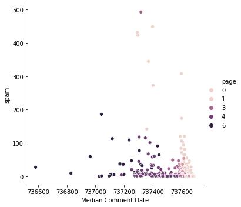


    <matplotlib.collections.PathCollection at 0x7f2b1a149550>


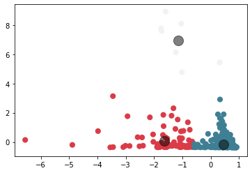


```python

cost =[] 
for i in range(1, 11): 
    kmeans = KMeans(n_clusters=i, random_state=0)
    kmeans.fit(X)
      
    # calculates squared error 
    # for the clustered points 
    cost.append(kmeans.inertia_)      
  
# plot the cost against K values 
plt.plot(range(1, 11), cost, color ='g', linewidth ='3') 
plt.xlabel("Value of K") 
plt.ylabel("Sqaured Error (Cost)") 
plt.show() # clear the plot 

sil = []
kmax = 10

# dissimilarity would not be defined for a single cluster, thus, minimum number of clusters should be 2
for k in range(2, kmax+1):
  kmeans = KMeans(n_clusters = k).fit(X)
  labels = kmeans.labels_
  sil.append(silhouette_score(X, labels, metric = 'euclidean'))

# plot the cost against K values 
plt.plot(range(2, 11), sil, color ='g', linewidth ='3') 
plt.xlabel("Value of K") 
plt.ylabel("Silhouette score") 
plt.show() # clear the plot 
```


```python
spam_percent['meddate_spam'] = kmeans.labels_

spam_percent = pd.get_dummies(spam_percent,columns=['meddate_spam'], prefix='meddate_spam', drop_first=True)

```

## Number of Comments Plot


```python
sns.relplot(x='Number of Comments',y='Median Comment Date',hue='scroll', data=spam_percent)
```

### spam_percent: Number of Comments v. Median Comment Date


```python
X = spam_percent[['Median Comment Date', 'Number of Comments']]
kmeans = KMeans(n_clusters=4, random_state=0).fit(X)
y_kmeans = kmeans.predict(X)

plt.scatter(X.iloc[:, 1], X.iloc[:, 0], c=y_kmeans, s=50, cmap=cmap)

centers = kmeans.cluster_centers_
plt.scatter(centers[:, 1], centers[:, 0], c='black', s=200, alpha=0.5)
```


    <matplotlib.collections.PathCollection at 0x7f2b1a288e20>


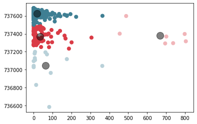


```python
# accuracy = []
# precision = []
# X = spam_percent[['Median Comment Date', 'Number of Comments']]

# # dissimilarity would not be defined for a single cluster, thus, minimum number of clusters should be 2
# for k in range(3, 11):
#     kmeans = KMeans(n_clusters=k).fit(X)
#     spam_percent['meddate_com'] = kmeans.labels_
#     #corrs.append(spam_percent[['sku_pics', 'page']].corr().loc['page','sku_pics'])
#     accuracy.append(accuracy_score(spam_percent['meddate_com'], spam_percent['page']))
#     precision.append(precision_score(spam_percent['meddate_com'], spam_percent['page'], average='weighted'))

# # plot the cost against K values 
# plt.plot(range(3, 11), precision, color ='g', linewidth ='3') 
# plt.xlabel("clusters") 
# plt.ylabel("precision") 
# plt.show() # clear the plot 


# # plot the cost against K values 
# plt.plot(range(3, 11), accuracy, color ='g', linewidth ='3') 
# plt.xlabel("clusters") 
# plt.ylabel("accuracy") 
# plt.show() # clear the plot 

```


```python

cost =[] 
for i in range(1, 11): 
    kmeans = KMeans(n_clusters=i, random_state=0)
    kmeans.fit(X)
      
    # calculates squared error 
    # for the clustered points 
    cost.append(kmeans.inertia_)      
  
# plot the cost against K values 
plt.plot(range(1, 11), cost, color ='g', linewidth ='3') 
plt.xlabel("Value of K") 
plt.ylabel("Sqaured Error (Cost)") 
plt.show() # clear the plot 

sil = []
kmax = 10

# dissimilarity would not be defined for a single cluster, thus, minimum number of clusters should be 2
for k in range(2, kmax+1):
  kmeans = KMeans(n_clusters = k).fit(X)
  labels = kmeans.labels_
  sil.append(silhouette_score(X, labels, metric = 'euclidean'))

# plot the cost against K values 
plt.plot(range(2, 11), sil, color ='g', linewidth ='3') 
plt.xlabel("Value of K") 
plt.ylabel("Silhouette score") 
plt.show() # clear the plot 
```


```python
spam_percent['meddate_com'] = kmeans.labels_

spam_percent = pd.get_dummies(spam_percent,columns=['meddate_com'], prefix='meddate_com', drop_first=True)
```

### spam_percent: Number of Comments v. 75th Comment Date


```python
X = spam_percent[['75th Comment Date', 'Number of Comments']]
kmeans = KMeans(n_clusters=4, random_state=0).fit(X)
y_kmeans = kmeans.predict(X)

sns.relplot(x='Number of Comments',y='75th Comment Date',hue='page', data=spam_percent)
plt.show()

plt.scatter(X.iloc[:, 1], X.iloc[:, 0], c=y_kmeans, s=50, cmap=cmap)

centers = kmeans.cluster_centers_
plt.scatter(centers[:, 1], centers[:, 0], c='black', s=200, alpha=0.5)
```


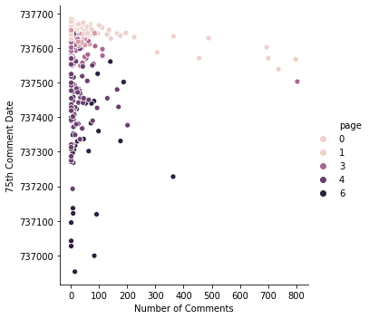


    <matplotlib.collections.PathCollection at 0x7f2b19aa18b0>


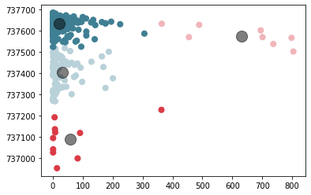


```python

cost =[] 
for i in range(1, 11): 
    kmeans = KMeans(n_clusters=i, random_state=0)
    kmeans.fit(X)
      
    # calculates squared error 
    # for the clustered points 
    cost.append(kmeans.inertia_)      
  
# plot the cost against K values 
plt.plot(range(1, 11), cost, color ='g', linewidth ='3') 
plt.xlabel("Value of K") 
plt.ylabel("Sqaured Error (Cost)") 
plt.show() # clear the plot 

sil = []
kmax = 10

# dissimilarity would not be defined for a single cluster, thus, minimum number of clusters should be 2
for k in range(2, kmax+1):
  kmeans = KMeans(n_clusters = k).fit(X)
  labels = kmeans.labels_
  sil.append(silhouette_score(X, labels, metric = 'euclidean'))

# plot the cost against K values 
plt.plot(range(2, 11), sil, color ='g', linewidth ='3') 
plt.xlabel("Value of K") 
plt.ylabel("Silhouette score") 
plt.show() # clear the plot 
```


```python
spam_percent['75date_com'] = kmeans.labels_

spam_percent = pd.get_dummies(spam_percent, columns=['75date_com'], prefix='75date_com',drop_first=True)

```


```python
spam_percent.filter(regex='75date_com').columns
```

### spam_percent: Number of Comments v. 25th Comment Date


```python
X = preprocessing.scale(spam_percent[['25th Comment Date', 'Number of Comments']])
kmeans = KMeans(n_clusters=3, random_state=0).fit(X)
y_kmeans = kmeans.predict(X)

sns.relplot(x='Number of Comments',y='25th Comment Date',hue='page', data=spam_percent)
plt.show()

plt.scatter(X[:, 1], X[:, 0], c=y_kmeans, s=50, cmap=cmap)

centers = kmeans.cluster_centers_
plt.scatter(centers[:, 1], centers[:, 0], c='black', s=200, alpha=0.5)
```


```python

cost =[] 
for i in range(1, 15): 
    kmeans = KMeans(n_clusters=i, random_state=0)
    kmeans.fit(X)
      
    # calculates squared error 
    # for the clustered points 
    cost.append(kmeans.inertia_)      
  
# plot the cost against K values 
plt.plot(range(1, 15), cost, color ='g', linewidth ='3') 
plt.xlabel("Value of K") 
plt.ylabel("Sqaured Error (Cost)") 
plt.show() # clear the plot 

sil = []
kmax = 14

# dissimilarity would not be defined for a single cluster, thus, minimum number of clusters should be 2
for k in range(2, kmax+1):
  kmeans = KMeans(n_clusters = k).fit(X)
  labels = kmeans.labels_
  sil.append(silhouette_score(X, labels, metric = 'euclidean'))

# plot the cost against K values 
plt.plot(range(2, kmax+1), sil, color ='g', linewidth ='3') 
plt.xlabel("Value of K") 
plt.ylabel("Silhouette score") 
plt.show() # clear the plot 
```


```python
spam_percent['25date_com'] = kmeans.labels_
spam_percent = pd.get_dummies(spam_percent,columns=['25date_com'], prefix='25date_com',drop_first=True)

```

### spam_percent: Number of Comments v. Max Comment Date


```python
X = spam_percent[['Max Comment Date', 'Number of Comments']]
kmeans = KMeans(n_clusters=3, random_state=0).fit(X)
y_kmeans = kmeans.predict(X)

sns.relplot(x='Number of Comments',y='Max Comment Date',hue='page', data=spam_percent)
plt.show()

plt.scatter(X.iloc[:, 1], X.iloc[:, 0], c=y_kmeans, s=50, cmap=cmap)

centers = kmeans.cluster_centers_
plt.scatter(centers[:, 1], centers[:, 0], c='black', s=200, alpha=0.5)
```


```python

cost =[] 
for i in range(1, 11): 
    kmeans = KMeans(n_clusters=i, random_state=0)
    kmeans.fit(X)
      
    # calculates squared error 
    # for the clustered points 
    cost.append(kmeans.inertia_)      
  
# plot the cost against K values 
plt.plot(range(1, 11), cost, color ='g', linewidth ='3') 
plt.xlabel("Value of K") 
plt.ylabel("Sqaured Error (Cost)") 
plt.show() # clear the plot 

sil = []
kmax = 10

# dissimilarity would not be defined for a single cluster, thus, minimum number of clusters should be 2
for k in range(2, kmax+1):
  kmeans = KMeans(n_clusters = k).fit(X)
  labels = kmeans.labels_
  sil.append(silhouette_score(X, labels, metric = 'euclidean'))

# plot the cost against K values 
plt.plot(range(2, 11), sil, color ='g', linewidth ='3') 
plt.xlabel("Value of K") 
plt.ylabel("Silhouette score") 
plt.show() # clear the plot 
```


```python
spam_percent['maxdate_com'] = kmeans.labels_

spam_percent = pd.get_dummies(spam_percent, columns = ['maxdate_com'], prefix='maxdate_com', drop_first=True)

```

### spam_percent: Number of Comments v. Min Comment Date


```python
X = spam_percent[['Min Comment Date', 'Number of Comments']]
kmeans = KMeans(n_clusters=3, random_state=0).fit(X)
y_kmeans = kmeans.predict(X)

sns.relplot(x='Number of Comments',y='Min Comment Date',hue='scroll', data=spam_percent)
plt.show()

plt.scatter(X.iloc[:, 1], X.iloc[:, 0], c=y_kmeans, s=50, cmap=cmap)

centers = kmeans.cluster_centers_
plt.scatter(centers[:, 1], centers[:, 0], c='black', s=200, alpha=0.5)
```


```python

cost =[] 
for i in range(1, 11): 
    kmeans = KMeans(n_clusters=i, random_state=0)
    kmeans.fit(X)
      
    # calculates squared error 
    # for the clustered points 
    cost.append(kmeans.inertia_)      
  
# plot the cost against K values 
plt.plot(range(1, 11), cost, color ='g', linewidth ='3') 
plt.xlabel("Value of K") 
plt.ylabel("Sqaured Error (Cost)") 
plt.show() # clear the plot 

sil = []
kmax = 10

# dissimilarity would not be defined for a single cluster, thus, minimum number of clusters should be 2
for k in range(2, kmax+1):
  kmeans = KMeans(n_clusters = k).fit(X)
  labels = kmeans.labels_
  sil.append(silhouette_score(X, labels, metric = 'euclidean'))

# plot the cost against K values 
plt.plot(range(2, 11), sil, color ='g', linewidth ='3') 
plt.xlabel("Value of K") 
plt.ylabel("Silhouette score") 
plt.show() # clear the plot 
```


```python
spam_percent['mindate_com'] = kmeans.labels_

spam_percent = pd.get_dummies(spam_percent,columns=['mindate_com'], prefix='mindate_com', drop_first=True)
```

### spam_percent: Number of Comments v. Mean Comment Date


```python
X = spam_percent[['Mean Comment Date', 'Number of Comments']]
kmeans = KMeans(n_clusters=4).fit(X)
y_kmeans = kmeans.predict(X)

sns.relplot(x='Number of Comments',y='Mean Comment Date',hue='page', data=spam_percent)
plt.show()

plt.scatter(X.iloc[:, 1], X.iloc[:, 0], c=y_kmeans, s=50, cmap=cmap)

centers = kmeans.cluster_centers_
plt.scatter(centers[:, 1], centers[:, 0], c='black', s=200, alpha=0.5)
```


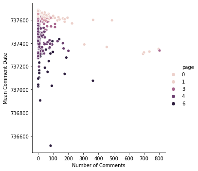


    <matplotlib.collections.PathCollection at 0x7f2b19db9c40>


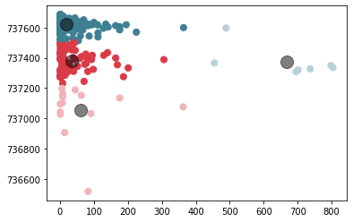


```python

cost =[] 
for i in range(1, 11): 
    kmeans = KMeans(n_clusters=i, random_state=0)
    kmeans.fit(X)
      
    # calculates squared error 
    # for the clustered points 
    cost.append(kmeans.inertia_)      
  
# plot the cost against K values 
plt.plot(range(1, 11), cost, color ='g', linewidth ='3') 
plt.xlabel("Value of K") 
plt.ylabel("Sqaured Error (Cost)") 
plt.show() # clear the plot 

sil = []
kmax = 10

# dissimilarity would not be defined for a single cluster, thus, minimum number of clusters should be 2
for k in range(2, kmax+1):
  kmeans = KMeans(n_clusters = k).fit(X)
  labels = kmeans.labels_
  sil.append(silhouette_score(X, labels, metric = 'euclidean'))

# plot the cost against K values 
plt.plot(range(2, 11), sil, color ='g', linewidth ='3') 
plt.xlabel("Value of K") 
plt.ylabel("Silhouette score") 
plt.show() # clear the plot 
```


```python
spam_percent['meandate_com'] = kmeans.labels_

spam_percent = pd.get_dummies(spam_percent,columns=['meandate_com'], prefix='meandate_com', drop_first=True)
```

### spam_percent: Number of Comments v. IQR Date


```python
X = preprocessing.scale(spam_percent[['IQR Date', 'Number of Comments']])
kmeans = KMeans(n_clusters=2).fit(X)
y_kmeans = kmeans.predict(X)

sns.relplot(x='Number of Comments',y='IQR Date',hue='page', data=spam_percent)
plt.show()

plt.scatter(X[:, 1], X[:, 0], c=y_kmeans, s=50, cmap=cmap)

centers = kmeans.cluster_centers_
plt.scatter(centers[:, 1], centers[:, 0], c='black', s=200, alpha=0.5)
```


```python

cost =[] 
for i in range(1, 11): 
    kmeans = KMeans(n_clusters=i, random_state=0)
    kmeans.fit(X)
      
    # calculates squared error 
    # for the clustered points 
    cost.append(kmeans.inertia_)      
  
# plot the cost against K values 
plt.plot(range(1, 11), cost, color ='g', linewidth ='3') 
plt.xlabel("Value of K") 
plt.ylabel("Sqaured Error (Cost)") 
plt.show() # clear the plot 

sil = []
kmax = 10

# dissimilarity would not be defined for a single cluster, thus, minimum number of clusters should be 2
for k in range(2, kmax+1):
  kmeans = KMeans(n_clusters = k).fit(X)
  labels = kmeans.labels_
  sil.append(silhouette_score(X, labels, metric = 'euclidean'))

# plot the cost against K values 
plt.plot(range(2, 11), sil, color ='g', linewidth ='3') 
plt.xlabel("Value of K") 
plt.ylabel("Silhouette score") 
plt.show() # clear the plot 
```


```python
spam_percent['iqrdate_com'] = kmeans.labels_

spam_percent= pd.get_dummies(spam_percent,columns=['iqrdate_com'], prefix='iqrdate_com',drop_first=True)
```

### reviews_cleaned: Word Cloud


```python
print('Non-unique comments')
spam_words = ' '.join(list(reviews_cleaned[reviews_cleaned['non_unique'] == 1]['Comment']))
spam_wc = WordCloud(width =512, height=512).generate(spam_words)
plt.figure(figsize=(10,8), facecolor = 'k')
plt.imshow(spam_wc)
plt.axis('off')
plt.tight_layout(pad = 0)
plt.show()

print('Unique comments')
spam_words = ' '.join(list(reviews_cleaned[reviews_cleaned['non_unique'] == 0]['Comment']))
spam_wc = WordCloud(width =512, height=512).generate(spam_words)
plt.figure(figsize=(10,8), facecolor = 'k')
plt.imshow(spam_wc)
plt.axis('off')
plt.tight_layout(pad = 0)
plt.show()

print('Spam')
spam_words = ' '.join(list(reviews_cleaned[reviews_cleaned['spam'] == 1]['Comment']))
spam_wc = WordCloud(width =512, height=512).generate(spam_words)
plt.figure(figsize=(10,8), facecolor = 'k')
plt.imshow(spam_wc)
plt.axis('off')
plt.tight_layout(pad = 0)
plt.show()

print('Non-spam')
spam_words = ' '.join(list(reviews_cleaned[reviews_cleaned['spam'] == 0]['Comment']))
spam_wc = WordCloud(width =512, height=512).generate(spam_words)
plt.figure(figsize=(10,8), facecolor = 'k')
plt.imshow(spam_wc)
plt.axis('off')
plt.tight_layout(pad = 0)
plt.show()
```

### Items 


```python
 # # One hot encode sizes 

items_cleaned = pd.get_dummies(items_cleaned,columns=['Size 0'], prefix='size',drop_first=True)

#df = pd.get_dummies(df, columns=['type'])
```


```python
items_cleaned.columns
```


```python
items_cleaned.describe()
```


```python
items_cleaned.corr()
```


```python
cmap = sns.diverging_palette(220, 10, as_cmap=True)

# Draw the heatmap with the mask and correct aspect ratio
sns.heatmap(items_cleaned.corr(), cmap=cmap, vmax=.3, center=0,
            square=True, linewidths=.5, cbar_kws={"shrink": .5})
```

## items_cleaned: Rank Plots


```python
items_cleaned.head()
```


```python
rank_plts = ['SKU group', 'Recommended Retail Price', 'Shop Price','Color 0', 'Size 0','Item Name Length','Number of Available Colors']
for i in rank_plts:
    sns.relplot(x='Rank', y=i,hue='scroll', data=items_cleaned)
    plt.show()
```


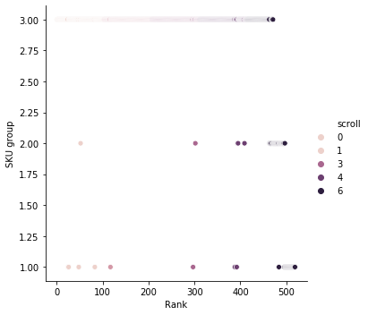


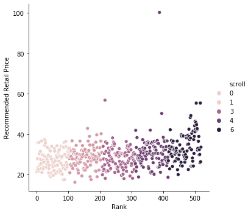


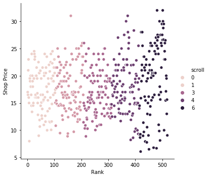


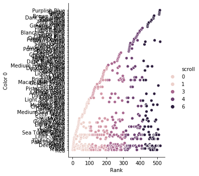


    ---------------------------------------------------------------------------

    ValueError                                Traceback (most recent call last)

    <ipython-input-273-0b9c6bc9ffe8> in <module>
          1 rank_plts = ['SKU group', 'Recommended Retail Price', 'Shop Price','Color 0', 'Size 0','Item Name Length','Number of Available Colors']
          2 for i in rank_plts:
    ----> 3     sns.relplot(x='Rank', y=i,hue='scroll', data=items_cleaned)
          4     plt.show()


    /opt/conda/lib/python3.8/site-packages/seaborn/relational.py in relplot(x, y, hue, size, style, data, row, col, col_wrap, row_order, col_order, palette, hue_order, hue_norm, sizes, size_order, size_norm, markers, dashes, style_order, legend, kind, height, aspect, facet_kws, **kwargs)
       1653 
       1654     # Use the full dataset to establish how to draw the semantics
    -> 1655     p = plotter(
       1656         x=x, y=y, hue=hue, size=size, style=style, data=data,
       1657         palette=palette, hue_order=hue_order, hue_norm=hue_norm,


    /opt/conda/lib/python3.8/site-packages/seaborn/relational.py in __init__(self, x, y, hue, size, style, data, palette, hue_order, hue_norm, sizes, size_order, size_norm, dashes, markers, style_order, x_bins, y_bins, units, estimator, ci, n_boot, alpha, x_jitter, y_jitter, legend)
        883                  legend=None):
        884 
    --> 885         plot_data = self.establish_variables(
        886             x, y, hue, size, style, units, data
        887         )


    /opt/conda/lib/python3.8/site-packages/seaborn/relational.py in establish_variables(self, x, y, hue, size, style, units, data)
        135                 if isinstance(var, str):
        136                     err = "Could not interpret input '{}'".format(var)
    --> 137                     raise ValueError(err)
        138 
        139             # Extract variable names


    ValueError: Could not interpret input 'Size 0'


## items_cleaned: SKU Plots 


```python
sku_plts = ['Number of Reviews','Recommended Retail Price','Item Name Length','Shop Price','Rank', 'price_diff']

for i in sku_plts:
    sns.relplot(x='SKU', y=i,hue='scroll', data=items_cleaned)
    plt.show()
```


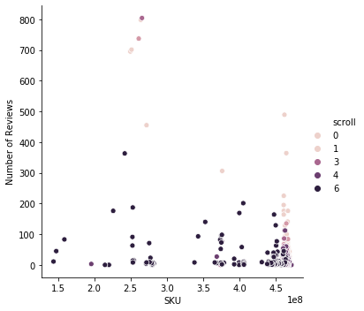


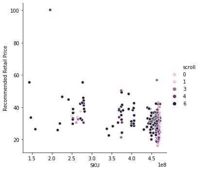


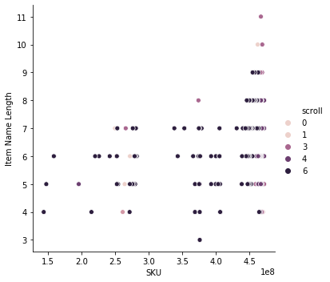


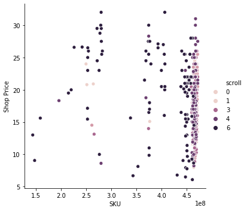


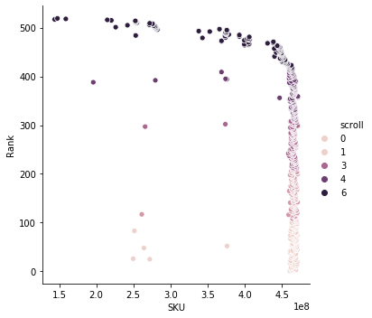


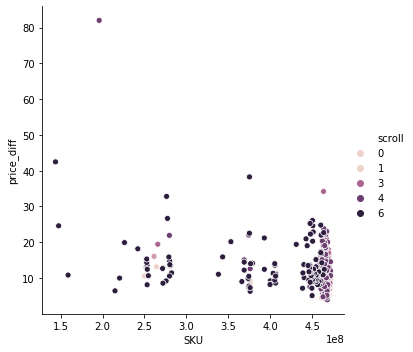


### items_cleaned: SKU vs. price_dif


```python
sns.relplot(x='price_diff', y='SKU',hue='scroll', data=items_cleaned)
plt.show()
X = items_cleaned[['price_diff','SKU']]
kmeans2 = KMeans(n_clusters=3, random_state=0).fit(X)
y_kmeans = kmeans2.predict(X)


plt.scatter(X.iloc[:, 0], X.iloc[:, 1], c=y_kmeans, s=50, cmap=cmap)

centers = kmeans2.cluster_centers_
plt.scatter(centers[:, 0], centers[:, 1], c='black', s=200, alpha=0.5)
```


```python

cost =[] 
for i in range(1, 11): 
    kmeans = KMeans(n_clusters=i, random_state=0)
    kmeans.fit(X)
      
    # calculates squared error 
    # for the clustered points 
    cost.append(kmeans.inertia_)      
  
# plot the cost against K values 
plt.plot(range(1, 11), cost, color ='g', linewidth ='3') 
plt.xlabel("Value of K") 
plt.ylabel("Sqaured Error (Cost)") 
plt.show() # clear the plot 

sil = []
kmax = 10

# dissimilarity would not be defined for a single cluster, thus, minimum number of clusters should be 2
for k in range(2, kmax+1):
  kmeans = KMeans(n_clusters = k).fit(X)
  labels = kmeans.labels_
  sil.append(silhouette_score(X, labels, metric = 'euclidean'))

# plot the cost against K values 
plt.plot(range(2, 11), sil, color ='g', linewidth ='3') 
plt.xlabel("Value of K") 
plt.ylabel("Silhouette score") 
plt.show() # clear the plot 
```


```python
items_cleaned['sku_pdif'] = kmeans2.labels_

items_cleaned = pd.get_dummies(items_cleaned,columns=['sku_pdif'], prefix='sku_pdif', drop_first=True)
```

### items_cleaned: SKU group v. Number of Reviews


```python
sns.relplot(x='SKU', y='Number of Reviews',hue='scroll', data=items_cleaned)
plt.show()
X = items_cleaned[['SKU','Number of Reviews']]
kmeans3 = KMeans(n_clusters=4, random_state=0).fit(X)
y_kmeans = kmeans3.predict(X)


plt.scatter(X.iloc[:, 0], X.iloc[:, 1], c=y_kmeans, s=50, cmap=cmap)

centers = kmeans3.cluster_centers_
plt.scatter(centers[:, 0], centers[:, 1], c='black', s=200, alpha=0.5)
```


```python

cost =[] 
for i in range(1, 11): 
    kmeans = KMeans(n_clusters=i, random_state=0)
    kmeans.fit(X)
      
    # calculates squared error 
    # for the clustered points 
    cost.append(kmeans.inertia_)      
  
# plot the cost against K values 
plt.plot(range(1, 11), cost, color ='g', linewidth ='3') 
plt.xlabel("Value of K") 
plt.ylabel("Sqaured Error (Cost)") 
plt.show() # clear the plot 

sil = []
kmax = 10

# dissimilarity would not be defined for a single cluster, thus, minimum number of clusters should be 2
for k in range(2, kmax+1):
  kmeans = KMeans(n_clusters = k).fit(X)
  labels = kmeans.labels_
  sil.append(silhouette_score(X, labels, metric = 'euclidean'))

# plot the cost against K values 
plt.plot(range(2, 11), sil, color ='g', linewidth ='3') 
plt.xlabel("Value of K") 
plt.ylabel("Silhouette score") 
plt.show() # clear the plot 
```


```python
items_cleaned['sku_rev'] = kmeans3.labels_

items_cleaned = pd.get_dummies(items_cleaned,columns=['sku_rev'], prefix='sku_rev', drop_first=True)

```

### items_cleaned: SKU group v. RRP


```python
sns.relplot(x='SKU', y='Recommended Retail Price',hue='scroll', data=items_cleaned)
plt.show()
X = items_cleaned[['SKU','Recommended Retail Price']]
kmeans1 = KMeans(n_clusters=4, random_state=0).fit(X)
y_kmeans = kmeans1.predict(X)


plt.scatter(X.iloc[:, 0], X.iloc[:, 1], c=y_kmeans, s=50, cmap=cmap)

centers = kmeans1.cluster_centers_
plt.scatter(centers[:, 0], centers[:, 1], c='black', s=200, alpha=0.5)
```


```python

cost =[] 
for i in range(1, 11): 
    kmeans = KMeans(n_clusters=i, random_state=0)
    kmeans.fit(X)
      
    # calculates squared error 
    # for the clustered points 
    cost.append(kmeans.inertia_)      
  
# plot the cost against K values 
plt.plot(range(1, 11), cost, color ='g', linewidth ='3') 
plt.xlabel("Value of K") 
plt.ylabel("Sqaured Error (Cost)") 
plt.show() # clear the plot 

sil = []
kmax = 10

# dissimilarity would not be defined for a single cluster, thus, minimum number of clusters should be 2
for k in range(2, kmax+1):
  kmeans = KMeans(n_clusters = k).fit(X)
  labels = kmeans.labels_
  sil.append(silhouette_score(X, labels, metric = 'euclidean'))

# plot the cost against K values 
plt.plot(range(2, 11), sil, color ='g', linewidth ='3') 
plt.xlabel("Value of K") 
plt.ylabel("Silhouette score") 
plt.show() # clear the plot 
```


```python
items_cleaned['sku_rrp'] = kmeans1.labels_

items_cleaned = pd.get_dummies(items_cleaned,columns=['sku_rrp'], prefix='sku_rrp', drop_first=True)
```

## items_cleaned: RRP Plots


```python
rrp_plts = ['Number of Reviews','Rank','Number of Available Colors','Shop Price']

for i in rrp_plts:
    sns.relplot(x='Recommended Retail Price', y=i,hue='scroll', data=items_cleaned)
    plt.show()
```


```python
sns.relplot(x='Recommended Retail Price', y='Number of Available Colors',hue='scroll', data=items_cleaned,y_jitter=True)
plt.show()
X = items_cleaned[['Recommended Retail Price','Number of Available Colors']]
kmeans4 = KMeans(n_clusters=4, random_state=0).fit(X)
y_kmeans = kmeans4.predict(X)

plt.scatter(X.iloc[:, 0], X.iloc[:, 1], c=y_kmeans, s=50, cmap=cmap)

centers = kmeans4.cluster_centers_
plt.scatter(centers[:, 0], centers[:, 1], c='black', s=200, alpha=0.5)
```


```python

cost =[] 
for i in range(1, 11): 
    kmeans = KMeans(n_clusters=i, random_state=0)
    kmeans.fit(X)
      
    # calculates squared error 
    # for the clustered points 
    cost.append(kmeans.inertia_)      
  
# plot the cost against K values 
plt.plot(range(1, 11), cost, color ='g', linewidth ='3') 
plt.xlabel("Value of K") 
plt.ylabel("Sqaured Error (Cost)") 
plt.show() # clear the plot 

sil = []
kmax = 10

# dissimilarity would not be defined for a single cluster, thus, minimum number of clusters should be 2
for k in range(2, kmax+1):
  kmeans = KMeans(n_clusters = k).fit(X)
  labels = kmeans.labels_
  sil.append(silhouette_score(X, labels, metric = 'euclidean'))

# plot the cost against K values 
plt.plot(range(2, 11), sil, color ='g', linewidth ='3') 
plt.xlabel("Value of K") 
plt.ylabel("Silhouette score") 
plt.show() # clear the plot 
```


```python
items_cleaned['rrp_col'] = kmeans4.labels_
items_cleaned = pd.get_dummies(items_cleaned,columns=['rrp_col'], prefix='rrp_col', drop_first=True)
```

## items_cleaned: Number of Reviews Plots


```python
num_review_plts = ['Item Name Length','Rank','Number of Available Colors']
for i in num_review_plts:
    sns.relplot(x='Number of Reviews', y=i,hue='scroll', data=items_cleaned)
    plt.show()
```

### items_cleaned: Number of Reviews v. Number of Available Colors


```python
sns.relplot(x='Number of Available Colors', y='Number of Reviews',hue='scroll', data=items_cleaned)
plt.show()
X = preprocessing.scale(items_cleaned[['Number of Available Colors','Number of Reviews']])
kmeans5 = KMeans(n_clusters=7, random_state=0).fit(X)
y_kmeans = kmeans5.predict(X)


plt.scatter(X[:, 0], X[:, 1], c=y_kmeans, s=50, cmap=cmap)

centers = kmeans5.cluster_centers_
plt.scatter(centers[:, 0], centers[:, 1], c='black', s=200, alpha=0.5)
```


```python

cost =[] 
for i in range(1, 11): 
    kmeans = KMeans(n_clusters=i, random_state=0)
    kmeans.fit(X)
      
    # calculates squared error 
    # for the clustered points 
    cost.append(kmeans.inertia_)      
  
# plot the cost against K values 
plt.plot(range(1, 11), cost, color ='g', linewidth ='3') 
plt.xlabel("Value of K") 
plt.ylabel("Sqaured Error (Cost)") 
plt.show() # clear the plot 

sil = []
kmax = 10

# dissimilarity would not be defined for a single cluster, thus, minimum number of clusters should be 2
for k in range(2, kmax+1):
  kmeans = KMeans(n_clusters = k).fit(X)
  labels = kmeans.labels_
  sil.append(silhouette_score(X, labels, metric = 'euclidean'))

# plot the cost against K values 
plt.plot(range(2, 11), sil, color ='g', linewidth ='3') 
plt.xlabel("Value of K") 
plt.ylabel("Silhouette score") 
plt.show() # clear the plot 
```


```python
# SKU labels
items_cleaned['rev_col'] = kmeans5.labels_
items_cleaned = pd.get_dummies(items_cleaned,columns=['rev_col'], prefix='rev_col', drop_first=True)
```


```python
def words_in_texts(words, texts):
    '''
    Args:
        words (list-like): words to find
        texts (Series): strings to search in
        
        >>> words_in_texts(['hello', 'bye', 'world'], 
                   pd.Series(['hello', 'hello worldhello']))
                array([[1, 0, 0],
                       [1, 0, 1]])
    Returns:
        NumPy array of 0s and 1s with shape (n, p) where n is the
        number of texts and p is the number of words.
    '''
    indicator_array = [[1 if (i.find(j) > -1) else 0 for j in words] for i in texts]
    #indicator_array = [1 for i in words if (j.string in i for j in texts)]
    return indicator_array

words_in_texts(['hello', 'bye', 'world'], 
                   pd.Series(['hello', 'hello worldhello']))

def count_words_in_texts(words, texts, number):
    indicator_array = [[1 if (i.find(j) > number) else 0 for j in words] for i in texts]
    #indicator_array = [1 for i in words if (j.string in i for j in texts)]
    return indicator_array
```

### Seeing if primary color impacts ranking


```python
top_colors = items_cleaned['Color 0'].value_counts().index[0:2]
#items_cleaned['Color 0'].value_counts()
```


```python
items_cleaned['Top Colors'] = [0] * len(items_cleaned)
for i in range(0,len(items_cleaned)):
    if items_cleaned.loc[i, 'Color 0'] in top_colors:
        items_cleaned.loc[i, 'Top Colors'] = 1
```


```python
sns.relplot(x='Rank', y='Number of Reviews', hue='Top Colors', data=items_cleaned)
```


```python
# # One hot encode color on model
items_primary_colors_encode = (items_cleaned['Color 0']).str.get_dummies(' ') 

# merge 'scroll' and primary colors into dataframe
items_cleaned = pd.concat([items_cleaned.reset_index(drop=True),items_primary_colors_encode.reset_index(drop=True)], axis=1)
# items_primary_colors_scroll_merged

# # One hot encode item name
items_item_name_encode = items_cleaned['Item Name'].map(str).str.get_dummies(' ') 

items_cleaned = pd.concat([items_cleaned.reset_index(drop=True),items_item_name_encode.reset_index(drop=True)], axis=1)
# items_primary_colors_scroll_merged
```


```python
#items_cleaned.to_csv (r'items_cleaned_kmeans.csv', index=False)
#reviews_cleaned.to_csv (r'reviews_cleaned.csv', index=False)
#spam_percent.to_csv (r'spam_percent_kmeans.csv', index=False)

spam_percent = pd.read_csv(r'spam_percent_kmeans.csv')
items_cleaned = pd.read_csv(r'items_cleaned_kmeans.csv')
reviews_cleaned = pd.read_csv(r'reviews_cleaned.csv')
```

# Phase 4: Modeling the Data


```python
#items_cleaned.to_csv (r'items_cleaned.csv', index=False)
#reviews_cleaned.to_csv (r'reviews_cleaned.csv', index=False)
#spam_percent.to_csv (r'spam_percent.csv', index=False)

#no kmeans
#spam_percent = pd.read_csv(r'spam_percent.csv')
#items_cleaned = pd.read_csv(r'items_cleaned.csv')
#reviews_cleaned = pd.read_csv(r'reviews_cleaned.csv')
```

## Get relevant columns


```python
items_cleaned.columns # length - 348
```


    Index(['Rank', 'SKU', 'Item Name', 'Shop Price', 'Recommended Retail Price',
           'Deals', 'Available Colors', 'Overall Rating', 'Number of Reviews',
           'True Fit Percentage',
           ...
           'Up', 'V', 'Vacation', 'Velvet', 'Waist', 'Wasit', 'Wrap', 'X', 'ZAFUL',
           'Zipper'],
          dtype='object', length=348)


```python
spam_percent.columns
```


    Index(['SKU', 'spam', 'Number of Comments', 'Median Comment Date',
           'Time (numerical)', 'Median Comment Length',
           'Median Number of Pictures', 'Total Pictures', 'Spam Percent', 'Rank',
           'scroll', 'page', 'Mean Comment Date', '25th Comment Date',
           '75th Comment Date', 'Min Comment Date', 'Max Comment Date',
           'Range Date', 'IQR Date', 'sku_com_1', 'sku_com_2', 'sku_com_3',
           'sku_pics_1', 'sku_pics_2', 'sku_pics_3', 'sku_medcom_1',
           'sku_medcom_2', 'sku_medcom_3', 'sku_spam_1', 'sku_spam_2',
           'sku_spam_3', 'meddate_spam_1', 'meddate_spam_2', 'meddate_com_1',
           'meddate_com_2', 'meddate_com_3', '75date_com_1', '75date_com_2',
           '75date_com_3', '25date_com_1', '25date_com_2', 'maxdate_com_1',
           'maxdate_com_2', 'mindate_com_1', 'mindate_com_2', 'meandate_com_1',
           'meandate_com_2', 'meandate_com_3', 'iqrdate_com_1'],
          dtype='object')


```python
items_model = items_cleaned.drop(['Deals','Available Colors','True Fit Percentage','Too Small Percentage','Too Large Percentage','Overall Rating','Rank','scroll','page'],axis=1)
items_model = pd.merge(items_model,spam_percent,on='SKU')
```

## Split training and testing data


```python
# splitting training and testing data

items_train = items_model.sample(frac=0.8,random_state=200) #random state is a seed value
items_test = items_model.drop(items_train.index)

```


```python
from sklearn.feature_selection import RFE
from sklearn.linear_model import LogisticRegression
num_feats= 20
X = items_train[items_train.corr().columns].drop(['scroll','Rank','page'], axis=1)
y = items_train['scroll']
rfe_selector = RFE(estimator=LogisticRegression(), n_features_to_select=num_feats, step=10, verbose=5)
rfe_selector.fit(preprocessing.scale(X), y)
rfe_support = rfe_selector.get_support()
rfe_feature = X.loc[:,rfe_support].columns.tolist()
print(str(len(rfe_feature)), 'selected features')
```

    Fitting estimator with 382 features.
    Fitting estimator with 372 features.
    Fitting estimator with 362 features.
    Fitting estimator with 352 features.
    Fitting estimator with 342 features.
    Fitting estimator with 332 features.


    /opt/conda/lib/python3.8/site-packages/sklearn/linear_model/_logistic.py:762: ConvergenceWarning: lbfgs failed to converge (status=1):
    STOP: TOTAL NO. of ITERATIONS REACHED LIMIT.
    
    Increase the number of iterations (max_iter) or scale the data as shown in:
        https://scikit-learn.org/stable/modules/preprocessing.html
    Please also refer to the documentation for alternative solver options:
        https://scikit-learn.org/stable/modules/linear_model.html#logistic-regression
      n_iter_i = _check_optimize_result(


    Fitting estimator with 322 features.
    Fitting estimator with 312 features.


    /opt/conda/lib/python3.8/site-packages/sklearn/linear_model/_logistic.py:762: ConvergenceWarning: lbfgs failed to converge (status=1):
    STOP: TOTAL NO. of ITERATIONS REACHED LIMIT.
    
    Increase the number of iterations (max_iter) or scale the data as shown in:
        https://scikit-learn.org/stable/modules/preprocessing.html
    Please also refer to the documentation for alternative solver options:
        https://scikit-learn.org/stable/modules/linear_model.html#logistic-regression
      n_iter_i = _check_optimize_result(


    Fitting estimator with 302 features.
    Fitting estimator with 292 features.
    Fitting estimator with 282 features.
    Fitting estimator with 272 features.
    Fitting estimator with 262 features.
    Fitting estimator with 252 features.
    Fitting estimator with 242 features.
    Fitting estimator with 232 features.
    Fitting estimator with 222 features.
    Fitting estimator with 212 features.
    Fitting estimator with 202 features.
    Fitting estimator with 192 features.
    Fitting estimator with 182 features.
    Fitting estimator with 172 features.
    Fitting estimator with 162 features.
    Fitting estimator with 152 features.
    Fitting estimator with 142 features.
    Fitting estimator with 132 features.
    Fitting estimator with 122 features.
    Fitting estimator with 112 features.
    Fitting estimator with 102 features.
    Fitting estimator with 92 features.
    Fitting estimator with 82 features.
    Fitting estimator with 72 features.
    Fitting estimator with 62 features.
    Fitting estimator with 52 features.
    Fitting estimator with 42 features.
    Fitting estimator with 32 features.
    Fitting estimator with 22 features.
    20 selected features


```python
rfe_feature
```


    ['Number of Reviews',
     'size_L',
     'size_M',
     'size_S',
     'Flower',
     'Hem',
     'Off',
     'Strap',
     'spam',
     'Number of Comments',
     'Median Comment Date',
     'Total Pictures',
     'Mean Comment Date',
     '25th Comment Date',
     '75th Comment Date',
     'Min Comment Date',
     'Max Comment Date',
     'meddate_spam_2',
     '75date_com_1',
     '25date_com_1']


```python

from sklearn.feature_selection import SelectFromModel
from sklearn.ensemble import RandomForestClassifier

X = items_train[items_train.corr().columns].drop(['scroll','Rank','page'], axis=1)
y = items_train['scroll']
num_feats=40

embeded_rf_selector = SelectFromModel(RandomForestClassifier(n_estimators=100), max_features=num_feats)
embeded_rf_selector.fit(X, y)

embeded_rf_support = embeded_rf_selector.get_support()
embeded_rf_feature = X.loc[:,embeded_rf_support].columns.tolist()
print(str(len(embeded_rf_feature)), 'selected features')
```

    40 selected features


```python
embeded_rf_feature
```


    ['SKU',
     'Shop Price',
     'Recommended Retail Price',
     'Number of Reviews',
     'Item Name Length',
     'Number of Available Colors',
     'price_diff',
     'size_L',
     'size_M',
     'size_S',
     'rrp_col_1',
     'Blue',
     'Ditsy',
     'Floral.1',
     'Mini',
     'Print',
     'Sleeve',
     'Tiny',
     'ZAFUL',
     'spam',
     'Number of Comments',
     'Median Comment Date',
     'Time (numerical)',
     'Median Comment Length',
     'Median Number of Pictures',
     'Total Pictures',
     'Spam Percent',
     'Mean Comment Date',
     '25th Comment Date',
     '75th Comment Date',
     'Min Comment Date',
     'Max Comment Date',
     'Range Date',
     'IQR Date',
     'meddate_spam_2',
     'meddate_com_3',
     '75date_com_1',
     '25date_com_1',
     'meandate_com_1',
     'meandate_com_3']


## One hot encode `Item Names`


```python

# # sort by scroll in descending order
# scroll_name_corr = item_name_scroll_merged.corr().abs().sort_values(by='scroll', axis=0, ascending=False).iloc[:,0]
# scroll_name_corr # correlations w/ scroll and all item name strings

# most_corr_names = scroll_name_corr[2:].index
# data = np.array(words_in_texts(most_corr_names, items_train['Item Name']))

# dict = {
#     most_corr_names[0]: data[:, 0],
#     most_corr_names[1]: data[:, 1],
#     most_corr_names[2]: data[:, 2],
#     most_corr_names[3]: data[:, 3],
#     most_corr_names[4]: data[:, 4],
#     most_corr_names[5]: data[:, 5],
#     most_corr_names[6]: data[:, 6],
#     most_corr_names[7]: data[:, 7],
#     most_corr_names[8]: data[:, 8],
#     most_corr_names[9]: data[:, 9],
#     most_corr_names[10]: data[:, 10],
#     most_corr_names[11]: data[:, 11],
#     most_corr_names[12]: data[:, 12]
#     #most_corr_names[13]: data[:, 13],
#     #most_corr_names[14]: data[:, 14],
#     #most_corr_names[15]: data[:, 15],
#     #most_corr_names[16]: data[:, 16],
#     #most_corr_names[17]: data[:, 17],
#     #most_corr_names[18]: data[:, 18],
#     #most_corr_names[19]: data[:, 19]
# }

# # plot 
# fig_dims = (24, 8)
# fig, ax = plt.subplots(figsize=fig_dims)
# train_melt = pd.DataFrame(dict)
# train_melt['type'] = items_cleaned['scroll']
# # train_melt = train_melt.melt('typ')
# sns.barplot(x="variable", y="value", hue="type",ax=ax, data=train_melt)

# # words = scroll_name_corr[words_index].index


# # words = ['Long', 'Ditsy', 'Open', 'A', 'Line', 'Ruffled', 'ZAFUL', 'Up', 'Floral', 'Low', 'Criss', 'Knotted','One','Tiered','Cap']
# #words = scroll_name_corr[2:].index

```

## One hot encode `Color 0`


```python

# # sort dataframe by descending correlations
# scroll_primary_color_corr =  .corr().abs().sort_values(by='scroll', axis=0, ascending=False).iloc[:,0]
# # select top correlated features
# primary_colors_scroll = scroll_primary_color_corr[2:].index

# primary_colors_scroll
# data = np.array(words_in_texts(primary_colors_scroll, items_train['Color 0']))


# dict = {
#     primary_colors_scroll[0]: data[:, 0],
#     primary_colors_scroll[1]: data[:, 1],
#     primary_colors_scroll[2]: data[:, 2],
#     primary_colors_scroll[3]: data[:, 3],
#     primary_colors_scroll[4]: data[:, 4],
#     primary_colors_scroll[5]: data[:, 5],
#     primary_colors_scroll[6]: data[:, 6],
#     primary_colors_scroll[7]: data[:, 7],
#     primary_colors_scroll[8]: data[:, 8],
#     primary_colors_scroll[9]: data[:, 9],
#     primary_colors_scroll[10]: data[:, 10],
#     primary_colors_scroll[11]: data[:, 11],
#     primary_colors_scroll[12]: data[:, 12],
#     #most_corr_names[13]: data[:, 13],
#     #most_corr_names[14]: data[:, 14],
#     #most_corr_names[15]: data[:, 15],
#     #most_corr_names[16]: data[:, 16],
#     #most_corr_names[17]: data[:, 17],
#     #most_corr_names[18]: data[:, 18],
#     #most_corr_names[19]: data[:, 19]
# }


# # plot most correlated primary colors with scroll
# fig_dims = (12, 8)
# fig, ax = plt.subplots(figsize=fig_dims)

# train_melt = pd.DataFrame(dict)
# train_melt['type'] = items_cleaned['scroll'] #.map({0: 'ham', 1: 'spam'})
# train_melt = train_melt.melt('type')
# train_melt
# sns.barplot(x="variable", y="value", hue="type",ax=ax, data=train_melt)
# plt.show()

# X_train = preprocessing.scale(np.array((words_in_texts(primary_colors_scroll, items_cleaned['Color 0']))))
# Y_train = items_cleaned['scroll']

# model = LogisticRegression(multi_class='multinomial',solver ='newton-cg').fit(X_train, Y_train)
# model

# training_accuracy = model.score(X_train, Y_train)
# print("Training Accuracy: ", training_accuracy)
# model.predict(X_train)


# predictions = model.predict(X_train)
# cm = metrics.confusion_matrix(Y_train, predictions)
# print(cm)
```

## Testing Item Name encode with items_train to predict scroll and page using Logistic Regression and Lasso


```python
rfe_feature[-8:]
```


    ---------------------------------------------------------------------------

    NameError                                 Traceback (most recent call last)

    <ipython-input-9-cc8f88fcaead> in <module>
    ----> 1 rfe_feature[-8:]
    

    NameError: name 'rfe_feature' is not defined


```python
for i in np.arange(5,60):
    top7 = items_train.corr().abs().sort_values(by='scroll', axis=0, ascending=False).loc[:,'scroll'][3:i].index
    X = preprocessing.scale(items_train[top7])
    
    X_train, X_test, y_train, y_test = train_test_split(X, Y, test_size=0.3) # 70% training and 30% test

    lm = LogisticRegression()
    #lm = LogisticRegression(multi_class='multinomial',solver ='newton-cg').fit(X_train, y_train)
    lm.fit(X_train, y_train)

    y_pred = lm.predict(X_test)
    cv_scores_linreg = cross_val_score(lm,X_train,y_train,scoring='accuracy')
    print("Mean 5-Fold CV Score: {}".format(np.mean(cv_scores_linreg)), i)
```

    Mean 5-Fold CV Score: 0.5391372549019608 5
    Mean 5-Fold CV Score: 0.5315294117647059 6
    Mean 5-Fold CV Score: 0.5552156862745098 7
    Mean 5-Fold CV Score: 0.515921568627451 8
    Mean 5-Fold CV Score: 0.5468235294117647 9
    Mean 5-Fold CV Score: 0.5748235294117647 10
    Mean 5-Fold CV Score: 0.5473725490196079 11
    Mean 5-Fold CV Score: 0.5549803921568628 12
    Mean 5-Fold CV Score: 0.5394509803921569 13
    Mean 5-Fold CV Score: 0.5234509803921569 14
    Mean 5-Fold CV Score: 0.492235294117647 15
    Mean 5-Fold CV Score: 0.5631372549019609 16
    Mean 5-Fold CV Score: 0.5590588235294118 17
    Mean 5-Fold CV Score: 0.5668235294117647 18
    Mean 5-Fold CV Score: 0.511686274509804 19
    Mean 5-Fold CV Score: 0.5474509803921569 20
    Mean 5-Fold CV Score: 0.523843137254902 21
    Mean 5-Fold CV Score: 0.49192156862745096 22
    Mean 5-Fold CV Score: 0.511921568627451 23
    Mean 5-Fold CV Score: 0.516 24
    Mean 5-Fold CV Score: 0.5826666666666667 25
    Mean 5-Fold CV Score: 0.5355294117647059 26
    Mean 5-Fold CV Score: 0.527607843137255 27
    Mean 5-Fold CV Score: 0.5352156862745099 28
    Mean 5-Fold CV Score: 0.5668235294117647 29
    Mean 5-Fold CV Score: 0.5317647058823529 30
    Mean 5-Fold CV Score: 0.5469019607843137 31
    Mean 5-Fold CV Score: 0.5825098039215687 32
    Mean 5-Fold CV Score: 0.48415686274509806 33
    Mean 5-Fold CV Score: 0.5004705882352941 34
    Mean 5-Fold CV Score: 0.5237647058823529 35
    Mean 5-Fold CV Score: 0.5199215686274511 36
    Mean 5-Fold CV Score: 0.5551372549019609 37
    Mean 5-Fold CV Score: 0.49592156862745096 38
    Mean 5-Fold CV Score: 0.5629019607843138 39


    /opt/conda/lib/python3.8/site-packages/sklearn/linear_model/_logistic.py:762: ConvergenceWarning: lbfgs failed to converge (status=1):
    STOP: TOTAL NO. of ITERATIONS REACHED LIMIT.
    
    Increase the number of iterations (max_iter) or scale the data as shown in:
        https://scikit-learn.org/stable/modules/preprocessing.html
    Please also refer to the documentation for alternative solver options:
        https://scikit-learn.org/stable/modules/linear_model.html#logistic-regression
      n_iter_i = _check_optimize_result(


    Mean 5-Fold CV Score: 0.5395294117647058 40
    Mean 5-Fold CV Score: 0.523686274509804 41
    Mean 5-Fold CV Score: 0.5356078431372548 42
    Mean 5-Fold CV Score: 0.5395294117647059 43
    Mean 5-Fold CV Score: 0.5749019607843138 44
    Mean 5-Fold CV Score: 0.5469019607843137 45
    Mean 5-Fold CV Score: 0.5314509803921569 46
    Mean 5-Fold CV Score: 0.5433725490196079 47


    /opt/conda/lib/python3.8/site-packages/sklearn/linear_model/_logistic.py:762: ConvergenceWarning: lbfgs failed to converge (status=1):
    STOP: TOTAL NO. of ITERATIONS REACHED LIMIT.
    
    Increase the number of iterations (max_iter) or scale the data as shown in:
        https://scikit-learn.org/stable/modules/preprocessing.html
    Please also refer to the documentation for alternative solver options:
        https://scikit-learn.org/stable/modules/linear_model.html#logistic-regression
      n_iter_i = _check_optimize_result(
    /opt/conda/lib/python3.8/site-packages/sklearn/linear_model/_logistic.py:762: ConvergenceWarning: lbfgs failed to converge (status=1):
    STOP: TOTAL NO. of ITERATIONS REACHED LIMIT.
    
    Increase the number of iterations (max_iter) or scale the data as shown in:
        https://scikit-learn.org/stable/modules/preprocessing.html
    Please also refer to the documentation for alternative solver options:
        https://scikit-learn.org/stable/modules/linear_model.html#logistic-regression
      n_iter_i = _check_optimize_result(
    /opt/conda/lib/python3.8/site-packages/sklearn/linear_model/_logistic.py:762: ConvergenceWarning: lbfgs failed to converge (status=1):
    STOP: TOTAL NO. of ITERATIONS REACHED LIMIT.
    
    Increase the number of iterations (max_iter) or scale the data as shown in:
        https://scikit-learn.org/stable/modules/preprocessing.html
    Please also refer to the documentation for alternative solver options:
        https://scikit-learn.org/stable/modules/linear_model.html#logistic-regression
      n_iter_i = _check_optimize_result(
    /opt/conda/lib/python3.8/site-packages/sklearn/linear_model/_logistic.py:762: ConvergenceWarning: lbfgs failed to converge (status=1):
    STOP: TOTAL NO. of ITERATIONS REACHED LIMIT.
    
    Increase the number of iterations (max_iter) or scale the data as shown in:
        https://scikit-learn.org/stable/modules/preprocessing.html
    Please also refer to the documentation for alternative solver options:
        https://scikit-learn.org/stable/modules/linear_model.html#logistic-regression
      n_iter_i = _check_optimize_result(


    Mean 5-Fold CV Score: 0.539607843137255 48


    /opt/conda/lib/python3.8/site-packages/sklearn/linear_model/_logistic.py:762: ConvergenceWarning: lbfgs failed to converge (status=1):
    STOP: TOTAL NO. of ITERATIONS REACHED LIMIT.
    
    Increase the number of iterations (max_iter) or scale the data as shown in:
        https://scikit-learn.org/stable/modules/preprocessing.html
    Please also refer to the documentation for alternative solver options:
        https://scikit-learn.org/stable/modules/linear_model.html#logistic-regression
      n_iter_i = _check_optimize_result(
    /opt/conda/lib/python3.8/site-packages/sklearn/linear_model/_logistic.py:762: ConvergenceWarning: lbfgs failed to converge (status=1):
    STOP: TOTAL NO. of ITERATIONS REACHED LIMIT.
    
    Increase the number of iterations (max_iter) or scale the data as shown in:
        https://scikit-learn.org/stable/modules/preprocessing.html
    Please also refer to the documentation for alternative solver options:
        https://scikit-learn.org/stable/modules/linear_model.html#logistic-regression
      n_iter_i = _check_optimize_result(


    Mean 5-Fold CV Score: 0.5394509803921569 49


    /opt/conda/lib/python3.8/site-packages/sklearn/linear_model/_logistic.py:762: ConvergenceWarning: lbfgs failed to converge (status=1):
    STOP: TOTAL NO. of ITERATIONS REACHED LIMIT.
    
    Increase the number of iterations (max_iter) or scale the data as shown in:
        https://scikit-learn.org/stable/modules/preprocessing.html
    Please also refer to the documentation for alternative solver options:
        https://scikit-learn.org/stable/modules/linear_model.html#logistic-regression
      n_iter_i = _check_optimize_result(
    /opt/conda/lib/python3.8/site-packages/sklearn/linear_model/_logistic.py:762: ConvergenceWarning: lbfgs failed to converge (status=1):
    STOP: TOTAL NO. of ITERATIONS REACHED LIMIT.
    
    Increase the number of iterations (max_iter) or scale the data as shown in:
        https://scikit-learn.org/stable/modules/preprocessing.html
    Please also refer to the documentation for alternative solver options:
        https://scikit-learn.org/stable/modules/linear_model.html#logistic-regression
      n_iter_i = _check_optimize_result(


    Mean 5-Fold CV Score: 0.5313725490196078 50


    /opt/conda/lib/python3.8/site-packages/sklearn/linear_model/_logistic.py:762: ConvergenceWarning: lbfgs failed to converge (status=1):
    STOP: TOTAL NO. of ITERATIONS REACHED LIMIT.
    
    Increase the number of iterations (max_iter) or scale the data as shown in:
        https://scikit-learn.org/stable/modules/preprocessing.html
    Please also refer to the documentation for alternative solver options:
        https://scikit-learn.org/stable/modules/linear_model.html#logistic-regression
      n_iter_i = _check_optimize_result(
    /opt/conda/lib/python3.8/site-packages/sklearn/linear_model/_logistic.py:762: ConvergenceWarning: lbfgs failed to converge (status=1):
    STOP: TOTAL NO. of ITERATIONS REACHED LIMIT.
    
    Increase the number of iterations (max_iter) or scale the data as shown in:
        https://scikit-learn.org/stable/modules/preprocessing.html
    Please also refer to the documentation for alternative solver options:
        https://scikit-learn.org/stable/modules/linear_model.html#logistic-regression
      n_iter_i = _check_optimize_result(
    /opt/conda/lib/python3.8/site-packages/sklearn/linear_model/_logistic.py:762: ConvergenceWarning: lbfgs failed to converge (status=1):
    STOP: TOTAL NO. of ITERATIONS REACHED LIMIT.
    
    Increase the number of iterations (max_iter) or scale the data as shown in:
        https://scikit-learn.org/stable/modules/preprocessing.html
    Please also refer to the documentation for alternative solver options:
        https://scikit-learn.org/stable/modules/linear_model.html#logistic-regression
      n_iter_i = _check_optimize_result(
    /opt/conda/lib/python3.8/site-packages/sklearn/linear_model/_logistic.py:762: ConvergenceWarning: lbfgs failed to converge (status=1):
    STOP: TOTAL NO. of ITERATIONS REACHED LIMIT.
    
    Increase the number of iterations (max_iter) or scale the data as shown in:
        https://scikit-learn.org/stable/modules/preprocessing.html
    Please also refer to the documentation for alternative solver options:
        https://scikit-learn.org/stable/modules/linear_model.html#logistic-regression
      n_iter_i = _check_optimize_result(
    /opt/conda/lib/python3.8/site-packages/sklearn/linear_model/_logistic.py:762: ConvergenceWarning: lbfgs failed to converge (status=1):
    STOP: TOTAL NO. of ITERATIONS REACHED LIMIT.
    
    Increase the number of iterations (max_iter) or scale the data as shown in:
        https://scikit-learn.org/stable/modules/preprocessing.html
    Please also refer to the documentation for alternative solver options:
        https://scikit-learn.org/stable/modules/linear_model.html#logistic-regression
      n_iter_i = _check_optimize_result(
    /opt/conda/lib/python3.8/site-packages/sklearn/linear_model/_logistic.py:762: ConvergenceWarning: lbfgs failed to converge (status=1):
    STOP: TOTAL NO. of ITERATIONS REACHED LIMIT.
    
    Increase the number of iterations (max_iter) or scale the data as shown in:
        https://scikit-learn.org/stable/modules/preprocessing.html
    Please also refer to the documentation for alternative solver options:
        https://scikit-learn.org/stable/modules/linear_model.html#logistic-regression
      n_iter_i = _check_optimize_result(
    /opt/conda/lib/python3.8/site-packages/sklearn/linear_model/_logistic.py:762: ConvergenceWarning: lbfgs failed to converge (status=1):
    STOP: TOTAL NO. of ITERATIONS REACHED LIMIT.
    
    Increase the number of iterations (max_iter) or scale the data as shown in:
        https://scikit-learn.org/stable/modules/preprocessing.html
    Please also refer to the documentation for alternative solver options:
        https://scikit-learn.org/stable/modules/linear_model.html#logistic-regression
      n_iter_i = _check_optimize_result(


    Mean 5-Fold CV Score: 0.5551372549019609 51


    /opt/conda/lib/python3.8/site-packages/sklearn/linear_model/_logistic.py:762: ConvergenceWarning: lbfgs failed to converge (status=1):
    STOP: TOTAL NO. of ITERATIONS REACHED LIMIT.
    
    Increase the number of iterations (max_iter) or scale the data as shown in:
        https://scikit-learn.org/stable/modules/preprocessing.html
    Please also refer to the documentation for alternative solver options:
        https://scikit-learn.org/stable/modules/linear_model.html#logistic-regression
      n_iter_i = _check_optimize_result(
    /opt/conda/lib/python3.8/site-packages/sklearn/linear_model/_logistic.py:762: ConvergenceWarning: lbfgs failed to converge (status=1):
    STOP: TOTAL NO. of ITERATIONS REACHED LIMIT.
    
    Increase the number of iterations (max_iter) or scale the data as shown in:
        https://scikit-learn.org/stable/modules/preprocessing.html
    Please also refer to the documentation for alternative solver options:
        https://scikit-learn.org/stable/modules/linear_model.html#logistic-regression
      n_iter_i = _check_optimize_result(
    /opt/conda/lib/python3.8/site-packages/sklearn/linear_model/_logistic.py:762: ConvergenceWarning: lbfgs failed to converge (status=1):
    STOP: TOTAL NO. of ITERATIONS REACHED LIMIT.
    
    Increase the number of iterations (max_iter) or scale the data as shown in:
        https://scikit-learn.org/stable/modules/preprocessing.html
    Please also refer to the documentation for alternative solver options:
        https://scikit-learn.org/stable/modules/linear_model.html#logistic-regression
      n_iter_i = _check_optimize_result(
    /opt/conda/lib/python3.8/site-packages/sklearn/linear_model/_logistic.py:762: ConvergenceWarning: lbfgs failed to converge (status=1):
    STOP: TOTAL NO. of ITERATIONS REACHED LIMIT.
    
    Increase the number of iterations (max_iter) or scale the data as shown in:
        https://scikit-learn.org/stable/modules/preprocessing.html
    Please also refer to the documentation for alternative solver options:
        https://scikit-learn.org/stable/modules/linear_model.html#logistic-regression
      n_iter_i = _check_optimize_result(
    /opt/conda/lib/python3.8/site-packages/sklearn/linear_model/_logistic.py:762: ConvergenceWarning: lbfgs failed to converge (status=1):
    STOP: TOTAL NO. of ITERATIONS REACHED LIMIT.
    
    Increase the number of iterations (max_iter) or scale the data as shown in:
        https://scikit-learn.org/stable/modules/preprocessing.html
    Please also refer to the documentation for alternative solver options:
        https://scikit-learn.org/stable/modules/linear_model.html#logistic-regression
      n_iter_i = _check_optimize_result(


    Mean 5-Fold CV Score: 0.507686274509804 52


    /opt/conda/lib/python3.8/site-packages/sklearn/linear_model/_logistic.py:762: ConvergenceWarning: lbfgs failed to converge (status=1):
    STOP: TOTAL NO. of ITERATIONS REACHED LIMIT.
    
    Increase the number of iterations (max_iter) or scale the data as shown in:
        https://scikit-learn.org/stable/modules/preprocessing.html
    Please also refer to the documentation for alternative solver options:
        https://scikit-learn.org/stable/modules/linear_model.html#logistic-regression
      n_iter_i = _check_optimize_result(


    Mean 5-Fold CV Score: 0.5552941176470588 53


    /opt/conda/lib/python3.8/site-packages/sklearn/linear_model/_logistic.py:762: ConvergenceWarning: lbfgs failed to converge (status=1):
    STOP: TOTAL NO. of ITERATIONS REACHED LIMIT.
    
    Increase the number of iterations (max_iter) or scale the data as shown in:
        https://scikit-learn.org/stable/modules/preprocessing.html
    Please also refer to the documentation for alternative solver options:
        https://scikit-learn.org/stable/modules/linear_model.html#logistic-regression
      n_iter_i = _check_optimize_result(
    /opt/conda/lib/python3.8/site-packages/sklearn/linear_model/_logistic.py:762: ConvergenceWarning: lbfgs failed to converge (status=1):
    STOP: TOTAL NO. of ITERATIONS REACHED LIMIT.
    
    Increase the number of iterations (max_iter) or scale the data as shown in:
        https://scikit-learn.org/stable/modules/preprocessing.html
    Please also refer to the documentation for alternative solver options:
        https://scikit-learn.org/stable/modules/linear_model.html#logistic-regression
      n_iter_i = _check_optimize_result(


    Mean 5-Fold CV Score: 0.5712156862745099 54


    /opt/conda/lib/python3.8/site-packages/sklearn/linear_model/_logistic.py:762: ConvergenceWarning: lbfgs failed to converge (status=1):
    STOP: TOTAL NO. of ITERATIONS REACHED LIMIT.
    
    Increase the number of iterations (max_iter) or scale the data as shown in:
        https://scikit-learn.org/stable/modules/preprocessing.html
    Please also refer to the documentation for alternative solver options:
        https://scikit-learn.org/stable/modules/linear_model.html#logistic-regression
      n_iter_i = _check_optimize_result(
    /opt/conda/lib/python3.8/site-packages/sklearn/linear_model/_logistic.py:762: ConvergenceWarning: lbfgs failed to converge (status=1):
    STOP: TOTAL NO. of ITERATIONS REACHED LIMIT.
    
    Increase the number of iterations (max_iter) or scale the data as shown in:
        https://scikit-learn.org/stable/modules/preprocessing.html
    Please also refer to the documentation for alternative solver options:
        https://scikit-learn.org/stable/modules/linear_model.html#logistic-regression
      n_iter_i = _check_optimize_result(
    /opt/conda/lib/python3.8/site-packages/sklearn/linear_model/_logistic.py:762: ConvergenceWarning: lbfgs failed to converge (status=1):
    STOP: TOTAL NO. of ITERATIONS REACHED LIMIT.
    
    Increase the number of iterations (max_iter) or scale the data as shown in:
        https://scikit-learn.org/stable/modules/preprocessing.html
    Please also refer to the documentation for alternative solver options:
        https://scikit-learn.org/stable/modules/linear_model.html#logistic-regression
      n_iter_i = _check_optimize_result(
    /opt/conda/lib/python3.8/site-packages/sklearn/linear_model/_logistic.py:762: ConvergenceWarning: lbfgs failed to converge (status=1):
    STOP: TOTAL NO. of ITERATIONS REACHED LIMIT.
    
    Increase the number of iterations (max_iter) or scale the data as shown in:
        https://scikit-learn.org/stable/modules/preprocessing.html
    Please also refer to the documentation for alternative solver options:
        https://scikit-learn.org/stable/modules/linear_model.html#logistic-regression
      n_iter_i = _check_optimize_result(
    /opt/conda/lib/python3.8/site-packages/sklearn/linear_model/_logistic.py:762: ConvergenceWarning: lbfgs failed to converge (status=1):
    STOP: TOTAL NO. of ITERATIONS REACHED LIMIT.
    
    Increase the number of iterations (max_iter) or scale the data as shown in:
        https://scikit-learn.org/stable/modules/preprocessing.html
    Please also refer to the documentation for alternative solver options:
        https://scikit-learn.org/stable/modules/linear_model.html#logistic-regression
      n_iter_i = _check_optimize_result(
    /opt/conda/lib/python3.8/site-packages/sklearn/linear_model/_logistic.py:762: ConvergenceWarning: lbfgs failed to converge (status=1):
    STOP: TOTAL NO. of ITERATIONS REACHED LIMIT.
    
    Increase the number of iterations (max_iter) or scale the data as shown in:
        https://scikit-learn.org/stable/modules/preprocessing.html
    Please also refer to the documentation for alternative solver options:
        https://scikit-learn.org/stable/modules/linear_model.html#logistic-regression
      n_iter_i = _check_optimize_result(
    /opt/conda/lib/python3.8/site-packages/sklearn/linear_model/_logistic.py:762: ConvergenceWarning: lbfgs failed to converge (status=1):
    STOP: TOTAL NO. of ITERATIONS REACHED LIMIT.
    
    Increase the number of iterations (max_iter) or scale the data as shown in:
        https://scikit-learn.org/stable/modules/preprocessing.html
    Please also refer to the documentation for alternative solver options:
        https://scikit-learn.org/stable/modules/linear_model.html#logistic-regression
      n_iter_i = _check_optimize_result(


    Mean 5-Fold CV Score: 0.5827450980392157 55


    /opt/conda/lib/python3.8/site-packages/sklearn/linear_model/_logistic.py:762: ConvergenceWarning: lbfgs failed to converge (status=1):
    STOP: TOTAL NO. of ITERATIONS REACHED LIMIT.
    
    Increase the number of iterations (max_iter) or scale the data as shown in:
        https://scikit-learn.org/stable/modules/preprocessing.html
    Please also refer to the documentation for alternative solver options:
        https://scikit-learn.org/stable/modules/linear_model.html#logistic-regression
      n_iter_i = _check_optimize_result(
    /opt/conda/lib/python3.8/site-packages/sklearn/linear_model/_logistic.py:762: ConvergenceWarning: lbfgs failed to converge (status=1):
    STOP: TOTAL NO. of ITERATIONS REACHED LIMIT.
    
    Increase the number of iterations (max_iter) or scale the data as shown in:
        https://scikit-learn.org/stable/modules/preprocessing.html
    Please also refer to the documentation for alternative solver options:
        https://scikit-learn.org/stable/modules/linear_model.html#logistic-regression
      n_iter_i = _check_optimize_result(
    /opt/conda/lib/python3.8/site-packages/sklearn/linear_model/_logistic.py:762: ConvergenceWarning: lbfgs failed to converge (status=1):
    STOP: TOTAL NO. of ITERATIONS REACHED LIMIT.
    
    Increase the number of iterations (max_iter) or scale the data as shown in:
        https://scikit-learn.org/stable/modules/preprocessing.html
    Please also refer to the documentation for alternative solver options:
        https://scikit-learn.org/stable/modules/linear_model.html#logistic-regression
      n_iter_i = _check_optimize_result(


    Mean 5-Fold CV Score: 0.5274509803921569 56


    /opt/conda/lib/python3.8/site-packages/sklearn/linear_model/_logistic.py:762: ConvergenceWarning: lbfgs failed to converge (status=1):
    STOP: TOTAL NO. of ITERATIONS REACHED LIMIT.
    
    Increase the number of iterations (max_iter) or scale the data as shown in:
        https://scikit-learn.org/stable/modules/preprocessing.html
    Please also refer to the documentation for alternative solver options:
        https://scikit-learn.org/stable/modules/linear_model.html#logistic-regression
      n_iter_i = _check_optimize_result(
    /opt/conda/lib/python3.8/site-packages/sklearn/linear_model/_logistic.py:762: ConvergenceWarning: lbfgs failed to converge (status=1):
    STOP: TOTAL NO. of ITERATIONS REACHED LIMIT.
    
    Increase the number of iterations (max_iter) or scale the data as shown in:
        https://scikit-learn.org/stable/modules/preprocessing.html
    Please also refer to the documentation for alternative solver options:
        https://scikit-learn.org/stable/modules/linear_model.html#logistic-regression
      n_iter_i = _check_optimize_result(
    /opt/conda/lib/python3.8/site-packages/sklearn/linear_model/_logistic.py:762: ConvergenceWarning: lbfgs failed to converge (status=1):
    STOP: TOTAL NO. of ITERATIONS REACHED LIMIT.
    
    Increase the number of iterations (max_iter) or scale the data as shown in:
        https://scikit-learn.org/stable/modules/preprocessing.html
    Please also refer to the documentation for alternative solver options:
        https://scikit-learn.org/stable/modules/linear_model.html#logistic-regression
      n_iter_i = _check_optimize_result(
    /opt/conda/lib/python3.8/site-packages/sklearn/linear_model/_logistic.py:762: ConvergenceWarning: lbfgs failed to converge (status=1):
    STOP: TOTAL NO. of ITERATIONS REACHED LIMIT.
    
    Increase the number of iterations (max_iter) or scale the data as shown in:
        https://scikit-learn.org/stable/modules/preprocessing.html
    Please also refer to the documentation for alternative solver options:
        https://scikit-learn.org/stable/modules/linear_model.html#logistic-regression
      n_iter_i = _check_optimize_result(
    /opt/conda/lib/python3.8/site-packages/sklearn/linear_model/_logistic.py:762: ConvergenceWarning: lbfgs failed to converge (status=1):
    STOP: TOTAL NO. of ITERATIONS REACHED LIMIT.
    
    Increase the number of iterations (max_iter) or scale the data as shown in:
        https://scikit-learn.org/stable/modules/preprocessing.html
    Please also refer to the documentation for alternative solver options:
        https://scikit-learn.org/stable/modules/linear_model.html#logistic-regression
      n_iter_i = _check_optimize_result(


    Mean 5-Fold CV Score: 0.5630588235294118 57


    /opt/conda/lib/python3.8/site-packages/sklearn/linear_model/_logistic.py:762: ConvergenceWarning: lbfgs failed to converge (status=1):
    STOP: TOTAL NO. of ITERATIONS REACHED LIMIT.
    
    Increase the number of iterations (max_iter) or scale the data as shown in:
        https://scikit-learn.org/stable/modules/preprocessing.html
    Please also refer to the documentation for alternative solver options:
        https://scikit-learn.org/stable/modules/linear_model.html#logistic-regression
      n_iter_i = _check_optimize_result(
    /opt/conda/lib/python3.8/site-packages/sklearn/linear_model/_logistic.py:762: ConvergenceWarning: lbfgs failed to converge (status=1):
    STOP: TOTAL NO. of ITERATIONS REACHED LIMIT.
    
    Increase the number of iterations (max_iter) or scale the data as shown in:
        https://scikit-learn.org/stable/modules/preprocessing.html
    Please also refer to the documentation for alternative solver options:
        https://scikit-learn.org/stable/modules/linear_model.html#logistic-regression
      n_iter_i = _check_optimize_result(
    /opt/conda/lib/python3.8/site-packages/sklearn/linear_model/_logistic.py:762: ConvergenceWarning: lbfgs failed to converge (status=1):
    STOP: TOTAL NO. of ITERATIONS REACHED LIMIT.
    
    Increase the number of iterations (max_iter) or scale the data as shown in:
        https://scikit-learn.org/stable/modules/preprocessing.html
    Please also refer to the documentation for alternative solver options:
        https://scikit-learn.org/stable/modules/linear_model.html#logistic-regression
      n_iter_i = _check_optimize_result(
    /opt/conda/lib/python3.8/site-packages/sklearn/linear_model/_logistic.py:762: ConvergenceWarning: lbfgs failed to converge (status=1):
    STOP: TOTAL NO. of ITERATIONS REACHED LIMIT.
    
    Increase the number of iterations (max_iter) or scale the data as shown in:
        https://scikit-learn.org/stable/modules/preprocessing.html
    Please also refer to the documentation for alternative solver options:
        https://scikit-learn.org/stable/modules/linear_model.html#logistic-regression
      n_iter_i = _check_optimize_result(


    Mean 5-Fold CV Score: 0.5232941176470588 58


    /opt/conda/lib/python3.8/site-packages/sklearn/linear_model/_logistic.py:762: ConvergenceWarning: lbfgs failed to converge (status=1):
    STOP: TOTAL NO. of ITERATIONS REACHED LIMIT.
    
    Increase the number of iterations (max_iter) or scale the data as shown in:
        https://scikit-learn.org/stable/modules/preprocessing.html
    Please also refer to the documentation for alternative solver options:
        https://scikit-learn.org/stable/modules/linear_model.html#logistic-regression
      n_iter_i = _check_optimize_result(
    /opt/conda/lib/python3.8/site-packages/sklearn/linear_model/_logistic.py:762: ConvergenceWarning: lbfgs failed to converge (status=1):
    STOP: TOTAL NO. of ITERATIONS REACHED LIMIT.
    
    Increase the number of iterations (max_iter) or scale the data as shown in:
        https://scikit-learn.org/stable/modules/preprocessing.html
    Please also refer to the documentation for alternative solver options:
        https://scikit-learn.org/stable/modules/linear_model.html#logistic-regression
      n_iter_i = _check_optimize_result(
    /opt/conda/lib/python3.8/site-packages/sklearn/linear_model/_logistic.py:762: ConvergenceWarning: lbfgs failed to converge (status=1):
    STOP: TOTAL NO. of ITERATIONS REACHED LIMIT.
    
    Increase the number of iterations (max_iter) or scale the data as shown in:
        https://scikit-learn.org/stable/modules/preprocessing.html
    Please also refer to the documentation for alternative solver options:
        https://scikit-learn.org/stable/modules/linear_model.html#logistic-regression
      n_iter_i = _check_optimize_result(
    /opt/conda/lib/python3.8/site-packages/sklearn/linear_model/_logistic.py:762: ConvergenceWarning: lbfgs failed to converge (status=1):
    STOP: TOTAL NO. of ITERATIONS REACHED LIMIT.
    
    Increase the number of iterations (max_iter) or scale the data as shown in:
        https://scikit-learn.org/stable/modules/preprocessing.html
    Please also refer to the documentation for alternative solver options:
        https://scikit-learn.org/stable/modules/linear_model.html#logistic-regression
      n_iter_i = _check_optimize_result(
    /opt/conda/lib/python3.8/site-packages/sklearn/linear_model/_logistic.py:762: ConvergenceWarning: lbfgs failed to converge (status=1):
    STOP: TOTAL NO. of ITERATIONS REACHED LIMIT.
    
    Increase the number of iterations (max_iter) or scale the data as shown in:
        https://scikit-learn.org/stable/modules/preprocessing.html
    Please also refer to the documentation for alternative solver options:
        https://scikit-learn.org/stable/modules/linear_model.html#logistic-regression
      n_iter_i = _check_optimize_result(


    Mean 5-Fold CV Score: 0.5155294117647059 59


    /opt/conda/lib/python3.8/site-packages/sklearn/linear_model/_logistic.py:762: ConvergenceWarning: lbfgs failed to converge (status=1):
    STOP: TOTAL NO. of ITERATIONS REACHED LIMIT.
    
    Increase the number of iterations (max_iter) or scale the data as shown in:
        https://scikit-learn.org/stable/modules/preprocessing.html
    Please also refer to the documentation for alternative solver options:
        https://scikit-learn.org/stable/modules/linear_model.html#logistic-regression
      n_iter_i = _check_optimize_result(


```python
for i in np.arange(5,100):
    X = preprocessing.scale(items_train[rfe_feature[-i:]])
    
    X_train, X_test, y_train, y_test = train_test_split(X, Y, test_size=0.3) # 70% training and 30% test

    lm = LogisticRegression()
    #lm = LogisticRegression(multi_class='multinomial',solver ='newton-cg').fit(X_train, y_train)
    lm.fit(X_train, y_train)

    y_pred = lm.predict(X_test)
    cv_scores_linreg = cross_val_score(lm,X_train,y_train,scoring='accuracy')
    print("Mean 5-Fold CV Score: {}".format(np.mean(cv_scores_linreg)), i)
```

    Mean 5-Fold CV Score: 0.40925490196078423 5
    Mean 5-Fold CV Score: 0.4290980392156863 6
    Mean 5-Fold CV Score: 0.4213333333333333 7
    Mean 5-Fold CV Score: 0.4804705882352941 8
    Mean 5-Fold CV Score: 0.5314509803921569 9
    Mean 5-Fold CV Score: 0.5549019607843138 10
    Mean 5-Fold CV Score: 0.5474509803921569 11
    Mean 5-Fold CV Score: 0.5512156862745098 12
    Mean 5-Fold CV Score: 0.5824313725490196 13
    Mean 5-Fold CV Score: 0.5669803921568628 14
    Mean 5-Fold CV Score: 0.5981960784313726 15
    Mean 5-Fold CV Score: 0.5945098039215686 16
    Mean 5-Fold CV Score: 0.5431372549019609 17
    Mean 5-Fold CV Score: 0.5668235294117647 18
    Mean 5-Fold CV Score: 0.6141960784313726 19
    Mean 5-Fold CV Score: 0.5905882352941176 20
    Mean 5-Fold CV Score: 0.5746666666666667 21
    Mean 5-Fold CV Score: 0.5509803921568628 22
    Mean 5-Fold CV Score: 0.5829803921568628 23
    Mean 5-Fold CV Score: 0.6022745098039216 24
    Mean 5-Fold CV Score: 0.5671372549019609 25
    Mean 5-Fold CV Score: 0.5472941176470589 26
    Mean 5-Fold CV Score: 0.5789803921568628 27
    Mean 5-Fold CV Score: 0.527607843137255 28
    Mean 5-Fold CV Score: 0.6222745098039215 29
    Mean 5-Fold CV Score: 0.6575686274509804 30
    Mean 5-Fold CV Score: 0.5901960784313725 31
    Mean 5-Fold CV Score: 0.5988235294117648 32
    Mean 5-Fold CV Score: 0.6061960784313726 33
    Mean 5-Fold CV Score: 0.5475294117647059 34
    Mean 5-Fold CV Score: 0.5945098039215686 35
    Mean 5-Fold CV Score: 0.6218039215686275 36
    Mean 5-Fold CV Score: 0.5865882352941176 37
    Mean 5-Fold CV Score: 0.5823529411764706 38
    Mean 5-Fold CV Score: 0.5747450980392157 39
    Mean 5-Fold CV Score: 0.6023529411764706 40
    Mean 5-Fold CV Score: 0.6179607843137255 41
    Mean 5-Fold CV Score: 0.5709019607843138 42
    Mean 5-Fold CV Score: 0.5908235294117647 43
    Mean 5-Fold CV Score: 0.5982745098039216 44
    Mean 5-Fold CV Score: 0.5709803921568628 45
    Mean 5-Fold CV Score: 0.5671372549019609 46
    Mean 5-Fold CV Score: 0.6378039215686274 47
    Mean 5-Fold CV Score: 0.5625882352941176 48
    Mean 5-Fold CV Score: 0.5789019607843138 49
    Mean 5-Fold CV Score: 0.5748235294117647 50
    Mean 5-Fold CV Score: 0.5788235294117647 51
    Mean 5-Fold CV Score: 0.535921568627451 52
    Mean 5-Fold CV Score: 0.508078431372549 53
    Mean 5-Fold CV Score: 0.5789019607843138 54
    Mean 5-Fold CV Score: 0.5396078431372549 55
    Mean 5-Fold CV Score: 0.539686274509804 56
    Mean 5-Fold CV Score: 0.5945882352941176 57
    Mean 5-Fold CV Score: 0.5785882352941176 58
    Mean 5-Fold CV Score: 0.5316078431372548 59
    Mean 5-Fold CV Score: 0.5862745098039216 60
    Mean 5-Fold CV Score: 0.5276862745098039 61
    Mean 5-Fold CV Score: 0.5592156862745099 62
    Mean 5-Fold CV Score: 0.5669803921568628 63
    Mean 5-Fold CV Score: 0.5393725490196078 64
    Mean 5-Fold CV Score: 0.5315294117647059 65
    Mean 5-Fold CV Score: 0.500235294117647 66
    Mean 5-Fold CV Score: 0.5705882352941176 67
    Mean 5-Fold CV Score: 0.5433725490196079 68
    Mean 5-Fold CV Score: 0.5706666666666667 69
    Mean 5-Fold CV Score: 0.5784313725490197 70
    Mean 5-Fold CV Score: 0.5509803921568628 71
    Mean 5-Fold CV Score: 0.5551372549019609 72
    Mean 5-Fold CV Score: 0.527843137254902 73
    Mean 5-Fold CV Score: 0.472313725490196 74
    Mean 5-Fold CV Score: 0.5551372549019609 75
    Mean 5-Fold CV Score: 0.5746666666666667 76
    Mean 5-Fold CV Score: 0.5783529411764706 77
    Mean 5-Fold CV Score: 0.5549803921568628 78
    Mean 5-Fold CV Score: 0.5434509803921569 79
    Mean 5-Fold CV Score: 0.5197647058823529 80
    Mean 5-Fold CV Score: 0.5629803921568628 81
    Mean 5-Fold CV Score: 0.49615686274509796 82
    Mean 5-Fold CV Score: 0.5475294117647059 83
    Mean 5-Fold CV Score: 0.49992156862745096 84
    Mean 5-Fold CV Score: 0.5352156862745098 85
    Mean 5-Fold CV Score: 0.5949803921568627 86
    Mean 5-Fold CV Score: 0.5232156862745099 87
    Mean 5-Fold CV Score: 0.5907450980392157 88
    Mean 5-Fold CV Score: 0.5707450980392157 89
    Mean 5-Fold CV Score: 0.5711372549019609 90
    Mean 5-Fold CV Score: 0.5948235294117648 91
    Mean 5-Fold CV Score: 0.5314509803921569 92
    Mean 5-Fold CV Score: 0.5551372549019609 93
    Mean 5-Fold CV Score: 0.6065882352941177 94
    Mean 5-Fold CV Score: 0.5822745098039216 95
    Mean 5-Fold CV Score: 0.5907450980392157 96
    Mean 5-Fold CV Score: 0.5589803921568628 97
    Mean 5-Fold CV Score: 0.5671372549019609 98
    Mean 5-Fold CV Score: 0.5117647058823529 99


# Random Forest


```python
X = preprocessing.scale(items_train[top40])
Y = items_train['scroll']

# Split dataset into training set and test set
X_train, X_test, y_train, y_test = train_test_split(X, Y, test_size=0.3) # 70% training and 30% test

# {'max_features': 'sqrt', 'n_estimators': 31}
rf = RandomForestClassifier(n_estimators=31,  max_features = 'sqrt')
rf.fit(X_train, y_train)
y_pred = rf.predict(X_test) 

cv_scores_linreg = cross_val_score(rf,X_train,y_train,scoring='accuracy')

# Model Accuracy, how often is the classifier correct?
print("Testing R^2: {}".format(rf.score(X_test, y_test)))
print("Training R^2: {}".format(rf.score(X_train, y_train)))
rmse = np.sqrt(mean_squared_error(y_test, y_pred))
print("Root Mean Squared Error: {}".format(rmse))
mae = mean_absolute_error(y_test, y_pred)
print("Mean Absolute Error: {}".format(mae))
print("Mean 5-Fold CV Score: {}".format(np.mean(cv_scores_linreg)))
print("5-Fold CV Scores: {}".format(cv_scores_linreg))
print(classification_report(y_test, np.round(y_pred)))

# Model Accuracy: how often is the classifier correct?
print("Accuracy:",metrics.accuracy_score(y_test, y_pred))
# Model Precision: what percentage of positive tuples are labeled as such?
print("Precision:",metrics.precision_score(y_test, y_pred,average='weighted'))

# Model Recall: what percentage of positive tuples are labelled as such?
print("Recall:",metrics.recall_score(y_test, y_pred,average='weighted'))
```

    Testing R^2: 0.5137614678899083
    Training R^2: 1.0
    Root Mean Squared Error: 1.121106923511292
    Mean Absolute Error: 0.7064220183486238
    Mean 5-Fold CV Score: 0.5865098039215686
    5-Fold CV Scores: [0.64705882 0.54901961 0.56862745 0.60784314 0.56      ]
                  precision    recall  f1-score   support
    
               1       0.52      0.73      0.60        22
               2       0.32      0.40      0.36        20
               3       0.42      0.23      0.29        22
               4       0.35      0.35      0.35        20
               5       0.95      0.80      0.87        25
    
        accuracy                           0.51       109
       macro avg       0.51      0.50      0.49       109
    weighted avg       0.53      0.51      0.51       109
    
    Accuracy: 0.5137614678899083
    Precision: 0.5296424695951183
    Recall: 0.5137614678899083


```python
top40 = items_train.corr().abs().sort_values(by='scroll', axis=0, ascending=False).loc[:,'scroll'][3:43].index
top40
```


    Index(['75th Comment Date', 'meddate_spam_2', 'Median Comment Date',
           'Mean Comment Date', '25date_com_1', 'meandate_com_1', 'meandate_com_3',
           '75date_com_1', 'meddate_com_3', 'mindate_com_2', '25th Comment Date',
           'Max Comment Date', 'Min Comment Date', 'maxdate_com_2', 'sku_rev_1',
           'sku_rrp_1', 'SKU', 'Recommended Retail Price', 'sku_medcom_2',
           'sku_pics_2', 'sku_com_2', 'sku_spam_2', 'sku_pdif_2', 'SKU group',
           'Number of Available Colors', 'rrp_col_3', 'price_diff', 'Range Date',
           'meddate_com_1', 'rrp<40', '75date_com_3', 'Ditsy', 'rev_col_5',
           'rev_col_6', 'Long', 'size_L', 'sku_pdif_1', 'rrp_col_1', 'IQR Date',
           'Maxi'],
          dtype='object')


```python
print(lm.get_params())
```

    {'C': 1.0, 'class_weight': None, 'dual': False, 'fit_intercept': True, 'intercept_scaling': 1, 'l1_ratio': None, 'max_iter': 100, 'multi_class': 'auto', 'n_jobs': None, 'penalty': 'l2', 'random_state': None, 'solver': 'lbfgs', 'tol': 0.0001, 'verbose': 0, 'warm_start': False}


```python


param_grid = [
    {'classifier' : [LogisticRegression()],
     'classifier__penalty' : ['l1', 'l2'],
    'classifier__C' : np.logspace(-4, 4, 20),
    'classifier__solver' : ['liblinear']},
    {'classifier' : [RandomForestClassifier()],
    'classifier__n_estimators' : list(range(10,101,10)),
    'classifier__max_features' : list(range(6,32,5))}
]
rfclassifier = {'n_estimators': range(1,100,10),
              #'criterion':('mae','mse'),
              'max_features':('auto','sqrt','log2')
}

logis_params = {
    'C':[1,10],
    'penalty':('l1','l2'),
    'solver':('lbfgs','liblinear')
}

GridS=GridSearchCV(lm,logis_params,cv=3)
GridS.fit(X_train,y_train)
GridS.best_params_
```

    /opt/conda/lib/python3.8/site-packages/sklearn/model_selection/_validation.py:548: FitFailedWarning: Estimator fit failed. The score on this train-test partition for these parameters will be set to nan. Details: 
    Traceback (most recent call last):
      File "/opt/conda/lib/python3.8/site-packages/sklearn/model_selection/_validation.py", line 531, in _fit_and_score
        estimator.fit(X_train, y_train, **fit_params)
      File "/opt/conda/lib/python3.8/site-packages/sklearn/linear_model/_logistic.py", line 1304, in fit
        solver = _check_solver(self.solver, self.penalty, self.dual)
      File "/opt/conda/lib/python3.8/site-packages/sklearn/linear_model/_logistic.py", line 442, in _check_solver
        raise ValueError("Solver %s supports only 'l2' or 'none' penalties, "
    ValueError: Solver lbfgs supports only 'l2' or 'none' penalties, got l1 penalty.
    
      warnings.warn("Estimator fit failed. The score on this train-test"
    /opt/conda/lib/python3.8/site-packages/sklearn/model_selection/_validation.py:548: FitFailedWarning: Estimator fit failed. The score on this train-test partition for these parameters will be set to nan. Details: 
    Traceback (most recent call last):
      File "/opt/conda/lib/python3.8/site-packages/sklearn/model_selection/_validation.py", line 531, in _fit_and_score
        estimator.fit(X_train, y_train, **fit_params)
      File "/opt/conda/lib/python3.8/site-packages/sklearn/linear_model/_logistic.py", line 1304, in fit
        solver = _check_solver(self.solver, self.penalty, self.dual)
      File "/opt/conda/lib/python3.8/site-packages/sklearn/linear_model/_logistic.py", line 442, in _check_solver
        raise ValueError("Solver %s supports only 'l2' or 'none' penalties, "
    ValueError: Solver lbfgs supports only 'l2' or 'none' penalties, got l1 penalty.
    
      warnings.warn("Estimator fit failed. The score on this train-test"
    /opt/conda/lib/python3.8/site-packages/sklearn/linear_model/_logistic.py:762: ConvergenceWarning: lbfgs failed to converge (status=1):
    STOP: TOTAL NO. of ITERATIONS REACHED LIMIT.
    
    Increase the number of iterations (max_iter) or scale the data as shown in:
        https://scikit-learn.org/stable/modules/preprocessing.html
    Please also refer to the documentation for alternative solver options:
        https://scikit-learn.org/stable/modules/linear_model.html#logistic-regression
      n_iter_i = _check_optimize_result(
    /opt/conda/lib/python3.8/site-packages/sklearn/linear_model/_logistic.py:762: ConvergenceWarning: lbfgs failed to converge (status=1):
    STOP: TOTAL NO. of ITERATIONS REACHED LIMIT.
    
    Increase the number of iterations (max_iter) or scale the data as shown in:
        https://scikit-learn.org/stable/modules/preprocessing.html
    Please also refer to the documentation for alternative solver options:
        https://scikit-learn.org/stable/modules/linear_model.html#logistic-regression
      n_iter_i = _check_optimize_result(
    /opt/conda/lib/python3.8/site-packages/sklearn/linear_model/_logistic.py:762: ConvergenceWarning: lbfgs failed to converge (status=1):
    STOP: TOTAL NO. of ITERATIONS REACHED LIMIT.
    
    Increase the number of iterations (max_iter) or scale the data as shown in:
        https://scikit-learn.org/stable/modules/preprocessing.html
    Please also refer to the documentation for alternative solver options:
        https://scikit-learn.org/stable/modules/linear_model.html#logistic-regression
      n_iter_i = _check_optimize_result(


    {'C': 1, 'penalty': 'l2', 'solver': 'lbfgs'}


```python
X = preprocessing.scale(items_train[top40])
Y = items_train['scroll']

# Split dataset into training set and test set
X_train, X_test, y_train, y_test = train_test_split(X, Y, test_size=0.3) # 70% training and 30% test

lm = LogisticRegression(fit_intercept=True,C=1,penalty='l2',solver='lbfgs')
#lm = LogisticRegression(multi_class='multinomial',solver ='newton-cg').fit(X_train, y_train)
lm.fit(X_train, y_train)

y_pred = lm.predict(X_test)
cv_scores_linreg = cross_val_score(lm,X_train,y_train,scoring='accuracy')

# Model Accuracy, how often is the classifier correct?
print("Testing R^2: {}".format(lm.score(X_test, y_test)))
print("Training R^2: {}".format(lm.score(X_train, y_train)))
rmse = np.sqrt(mean_squared_error(y_test, y_pred))
print("Root Mean Squared Error: {}".format(rmse))
mae = mean_absolute_error(y_test, y_pred)
print("Mean Absolute Error: {}".format(mae))
print("Mean 5-Fold CV Score: {}".format(np.mean(cv_scores_linreg)))
print("5-Fold CV Scores: {}".format(cv_scores_linreg))
print(classification_report(y_test, np.round(y_pred)))

# Model Accuracy: how often is the classifier correct?
print("Accuracy:",metrics.accuracy_score(y_test, y_pred))
# Model Precision: what percentage of positive tuples are labeled as such?
print("Precision:",metrics.precision_score(y_test, y_pred,average='weighted'))

# Model Recall: what percentage of positive tuples are labelled as such?
print("Recall:",metrics.recall_score(y_test, y_pred,average='weighted'))
```

    Testing R^2: 0.5779816513761468
    Training R^2: 0.6771653543307087
    Root Mean Squared Error: 0.9433494881965718
    Mean Absolute Error: 0.5596330275229358
    Mean 5-Fold CV Score: 0.5510588235294118
    5-Fold CV Scores: [0.52941176 0.60784314 0.54901961 0.54901961 0.52      ]
                  precision    recall  f1-score   support
    
               1       0.52      0.81      0.63        21
               2       0.38      0.26      0.31        23
               3       0.44      0.20      0.28        20
               4       0.42      0.69      0.52        16
               5       1.00      0.86      0.93        29
    
        accuracy                           0.58       109
       macro avg       0.55      0.56      0.53       109
    weighted avg       0.59      0.58      0.56       109
    
    Accuracy: 0.5779816513761468
    Precision: 0.5880853346449676
    Recall: 0.5779816513761468


```python
X = preprocessing.scale(items_test[top40])
Y = items_test['scroll']

y_pred = lm.predict(X)
cv_scores_linreg = cross_val_score(lm,X,Y,scoring='accuracy')

# Model Accuracy, how often is the classifier correct?
print("Testing R^2: {}".format(lm.score(X, Y)))
print("Training R^2: {}".format(lm.score(X, Y)))
rmse = np.sqrt(mean_squared_error(Y, y_pred))
print("Root Mean Squared Error: {}".format(rmse))
mae = mean_absolute_error(Y, y_pred)
print("Mean Absolute Error: {}".format(mae))
print("Mean 5-Fold CV Score: {}".format(np.mean(cv_scores_linreg)))
print("5-Fold CV Scores: {}".format(cv_scores_linreg))
print(classification_report(Y, np.round(y_pred)))

# Model Accuracy: how often is the classifier correct?
print("Accuracy:",metrics.accuracy_score(Y, y_pred))
# Model Precision: what percentage of positive tuples are labeled as such?
print("Precision:",metrics.precision_score(Y, y_pred,average='weighted'))

# Model Recall: what percentage of positive tuples are labelled as such?
print("Recall:",metrics.recall_score(Y, y_pred,average='weighted'))
```

    Testing R^2: 0.5824175824175825
    Training R^2: 0.5824175824175825
    Root Mean Squared Error: 1.079275296129382
    Mean Absolute Error: 0.6593406593406593
    Mean 5-Fold CV Score: 0.5163742690058479
    5-Fold CV Scores: [0.52631579 0.55555556 0.55555556 0.44444444 0.5       ]
                  precision    recall  f1-score   support
    
               1       0.47      0.94      0.63        17
               2       0.30      0.18      0.22        17
               3       0.50      0.19      0.28        21
               4       0.61      0.78      0.68        18
               5       1.00      0.89      0.94        18
    
        accuracy                           0.58        91
       macro avg       0.58      0.59      0.55        91
    weighted avg       0.58      0.58      0.54        91
    
    Accuracy: 0.5824175824175825
    Precision: 0.5775441949354994
    Recall: 0.5824175824175825


```python
confusion_matrix(y_test,y_pred)

top40
Testing R^2: 0.5596330275229358
Training R^2: 0.6535433070866141
Root Mean Squared Error: 0.8830722018960102
Mean Absolute Error: 0.5412844036697247
Mean 5-Fold CV Score: 0.5354509803921569
5-Fold CV Scores: [0.58823529 0.52941176 0.52941176 0.49019608 0.54      ]
              precision    recall  f1-score   support

           1       0.73      0.69      0.71        32
           2       0.19      0.22      0.21        18
           3       0.32      0.39      0.35        18
           4       0.50      0.39      0.44        18
           5       0.95      0.91      0.93        23

    accuracy                           0.56       109
   macro avg       0.54      0.52      0.53       109
weighted avg       0.58      0.56      0.57       109

Accuracy: 0.5596330275229358
Precision: 0.5832757456610668
Recall: 0.5596330275229358

rfe
Testing R^2: 0.5596330275229358
Training R^2: 0.6850393700787402
Root Mean Squared Error: 0.9187146985042236
Mean Absolute Error: 0.5688073394495413
Mean 5-Fold CV Score: 0.5429803921568628
5-Fold CV Scores: [0.49019608 0.66666667 0.52941176 0.56862745 0.46      ]
              precision    recall  f1-score   support

           1       0.61      0.81      0.69        21
           2       0.38      0.19      0.25        27
           3       0.23      0.20      0.21        15
           4       0.38      0.65      0.48        17
           5       0.96      0.86      0.91        29

    accuracy                           0.56       109
   macro avg       0.51      0.54      0.51       109
weighted avg       0.56      0.56      0.54       109

Accuracy: 0.5596330275229358
Precision: 0.5589820650719101
Recall: 0.5596330275229358
```


    array([[17,  3,  0,  1,  0],
           [ 8,  5,  6,  8,  0],
           [ 3,  4,  3,  5,  0],
           [ 0,  1,  4, 11,  1],
           [ 0,  0,  0,  4, 25]])


# Logistic Regression

## Preprocessing:
Testing Accuracy: .44
Training Accuracy: 1.0
Precision: .43
Recall: .44
RMSE: 1.200
MAE: .816
Mean CV Score: .473
Matrix: Does NOT do well predicting 1,2,3,or 4

## No preprocessing:
Testing Accuracy: .3119 
Training Accuracy: .276
Precision: .286
Recall: .312
RMSE: 1.879
MAE: .283
Mean CV Score: .284
Matrix: Does NOT do well predicting 1,2,3,or 4

## Preprocessing + top:
Testing R^2: 0.5688073394495413
Training R^2: 0.610236220472441
Root Mean Squared Error: 1.0579537112018993
Mean Absolute Error: 0.6238532110091743
Mean 5-Fold CV Score: 0.523607843137255
5-Fold CV Scores: [0.54901961 0.47058824 0.54901961 0.52941176 0.52      ]
              precision    recall  f1-score   support

           1       0.68      0.63      0.65        27
           2       0.35      0.37      0.36        19
           3       0.20      0.14      0.17        14
           4       0.46      0.52      0.49        23
           5       0.86      0.92      0.89        26

    accuracy                           0.57       109
   macro avg       0.51      0.52      0.51       109
weighted avg       0.56      0.57      0.56       109

Accuracy: 0.5688073394495413
Precision: 0.556982558725678
Recall: 0.5688073394495413
Matrix: Does well in predicting 5, 1 but not really, 2/3/4 are random

## No preprocessing + top:
Testing Accuracy: .3119 
Training Accuracy: .276
Precision: .288
Recall: .312
RMSE: 1.901
MAE: .287
Mean CV Score: .287
Matrix: Does NOT do well predicting 1,2,3,or 4; predicting everything as 1 and 5; no prediction for 3 and 4
Used column ranks from 15 - 75 and it was all basically the same accuracy


```python
# preprocessing + top:
metrics.confusion_matrix(y_test, y_pred)
```


```python
# no preprocessing + top:
metrics.confusion_matrix(y_test, y_pred)
```


```python
# preprocessing + all:
metrics.confusion_matrix(y_test, y_pred)
```


```python
# no preprocessing + all:
metrics.confusion_matrix(y_test, y_pred)
```


```python
top7 = items_train.corr().abs().sort_values(by='scroll', axis=0, ascending=False).loc[:,'scroll'][3:25].index
top7
```


```python
X = preprocessing.scale(items_train[top40])
Y = items_train['scroll']

# Split dataset into training set and test set
X_train, X_test, y_train, y_test = train_test_split(X, Y, test_size=0.3) # 70% training and 30% test

lm_l = Lasso(fit_intercept=False)
lm_l.fit(X_train, y_train)

y_pred = lm_l.predict(X_test)
y_pred =  [5 if i > 5 else i for i in y_pred]
y_pred =  [1 if i < 1 else int(i) for i in y_pred]

cv_scores_linreg = cross_val_score(lm_l,X_train,y_train)

# Model Accuracy, how often is the classifier correct?
print("Testing R^2: {}".format(lm_l.score(X_test, y_test)))
print("Training R^2: {}".format(lm_l.score(X_train, y_train)))
rmse = np.sqrt(mean_squared_error(y_test, y_pred))
print("Root Mean Squared Error: {}".format(rmse))
mae = mean_absolute_error(y_test, y_pred)
print("Mean Absolute Error: {}".format(mae))
print("Mean 5-Fold CV Score: {}".format(np.mean(cv_scores_linreg)))
print("5-Fold CV Scores: {}".format(cv_scores_linreg))
print(classification_report(y_test, y_pred))

# Model Accuracy: how often is the classifier correct?
print("Accuracy:",metrics.accuracy_score(y_test, y_pred))
# Model Precision: what percentage of positive tuples are labeled as such?
print("Precision:",metrics.precision_score(y_test, y_pred,average='weighted'))

# Model Recall: what percentage of positive tuples are labelled as such?
print("Recall:",metrics.recall_score(y_test, y_pred,average='weighted'))
```

    Testing R^2: -4.839126523268176
    Training R^2: -4.030640029808822
    Root Mean Squared Error: 2.5896760450582663
    Mean Absolute Error: 2.1559633027522938
    Mean 5-Fold CV Score: -4.13059554369176
    5-Fold CV Scores: [-4.40155502 -4.60075265 -4.04348959 -3.66693471 -3.94024575]
                  precision    recall  f1-score   support
    
               1       0.18      1.00      0.31        20
               2       0.00      0.00      0.00        18
               3       0.00      0.00      0.00        23
               4       0.00      0.00      0.00        21
               5       0.00      0.00      0.00        27
    
        accuracy                           0.18       109
       macro avg       0.04      0.20      0.06       109
    weighted avg       0.03      0.18      0.06       109
    
    Accuracy: 0.1834862385321101
    Precision: 0.03366719973066241
    Recall: 0.1834862385321101


    /opt/conda/lib/python3.8/site-packages/sklearn/metrics/_classification.py:1221: UndefinedMetricWarning: Precision and F-score are ill-defined and being set to 0.0 in labels with no predicted samples. Use `zero_division` parameter to control this behavior.
      _warn_prf(average, modifier, msg_start, len(result))
    /opt/conda/lib/python3.8/site-packages/sklearn/metrics/_classification.py:1221: UndefinedMetricWarning: Precision is ill-defined and being set to 0.0 in labels with no predicted samples. Use `zero_division` parameter to control this behavior.
      _warn_prf(average, modifier, msg_start, len(result))


# Lasso Regression

## Preprocessing:
Testing R^2: -0.0009146118387355351
Training R^2: 0.0
Root Mean Squared Error: 1.5174822218325925
Mean Absolute Error: 1.348623853211009
Mean 5-Fold CV Score: -0.017792120888463624
5-Fold CV Scores: [-0.02789701 -0.00424564 -0.00492708 -0.02314933 -0.02874154]
              precision    recall  f1-score   support

           1       0.00      0.00      0.00        24
           2       0.00      0.00      0.00        23
           3       0.13      1.00      0.23        14
           4       0.00      0.00      0.00        20
           5       0.00      0.00      0.00        28

    accuracy                           0.13       109
   macro avg       0.03      0.20      0.05       109
weighted avg       0.02      0.13      0.03       109

Accuracy: 0.12844036697247707
Precision: 0.0164969278680245

## No preprocessing:
Testing R^2: 0.48765299589483047
Training R^2: 0.6022126887167225
Root Mean Squared Error: 1.176996644395145
Mean Absolute Error: 0.908256880733945
Mean 5-Fold CV Score: 0.4486458348110715
5-Fold CV Scores: [ 0.57681577  0.63006374  0.65145061 -0.12279168  0.50769074]
              precision    recall  f1-score   support

           1       0.44      0.19      0.27        21
           2       0.30      0.88      0.45        24
           3       0.15      0.11      0.12        19
           4       0.09      0.05      0.06        21
           5       1.00      0.29      0.45        24

    accuracy                           0.32       109
   macro avg       0.40      0.30      0.27       109
weighted avg       0.42      0.32      0.28       109

Accuracy: 0.3211009174311927
Precision: 0.4171545779044782
Recall: 0.3211009174311927
Identifies everything as 2 basically

## Preprocessing + top:
Testing R^2: 0.5963302752293578
Training R^2: 0.594488188976378
Root Mean Squared Error: 1.1373556970672702
Mean Absolute Error: 0.8532110091743119
Mean 5-Fold CV Score: 0.5450428821405218
5-Fold CV Scores: [0.51690571 0.64133318 0.65327891 0.31658207 0.59711453]
              precision    recall  f1-score   support

           1       0.36      0.24      0.29        21
           2       0.30      0.79      0.43        24
           3       0.14      0.05      0.08        19
           4       0.08      0.05      0.06        21
           5       1.00      0.50      0.67        24

    accuracy                           0.35       109
   macro avg       0.38      0.33      0.30       109
weighted avg       0.40      0.35      0.32       109

Accuracy: 0.3486238532110092
Precision: 0.39531454783748365
Recall: 0.3486238532110092

## No preprocessing + top:
Testing R^2: 0.46079620143976097
Training R^2: 0.531436584715014
Root Mean Squared Error: 1.1963246468038928
Mean Absolute Error: 0.9357798165137615
Mean 5-Fold CV Score: 0.44780464278612647
5-Fold CV Scores: [0.4007053  0.41045862 0.58549928 0.51526944 0.32709058]
              precision    recall  f1-score   support

           1       0.67      0.08      0.14        25
           2       0.29      0.96      0.44        23
           3       0.07      0.06      0.06        18
           4       0.00      0.00      0.00        22
           5       1.00      0.24      0.38        21

    accuracy                           0.28       109
   macro avg       0.40      0.27      0.21       109
weighted avg       0.42      0.28      0.21       109

Accuracy: 0.27522935779816515
Precision: 0.4176496286588029
Recall: 0.27522935779816515
3:25 features


```python
# no preprocessing + all
metrics.confusion_matrix(y_test,y_pred)
```


```python
# preprocessing + top
metrics.confusion_matrix(y_test,y_pred)
```


```python
# no preprocessing + top
metrics.confusion_matrix(y_test,y_pred)
```


```python
alpha = []
err = []

for i in range(1,100):
    alpha.append(i/100)
    lm_l = Lasso(alpha=i/100, tol=2)
    err.append(np.mean(cross_val_score(lm_l, X_train,y_train,cv=5,scoring='neg_mean_squared_error')))
plt.plot(alpha,err)
```


```python
error = tuple(zip(alpha,err))
df_err = pd.DataFrame(error, columns=['alpha','error'])
df_err[df_err.error == max(df_err.error)]
```


```python
X = items_train[top40]
Y = items_train['scroll']

# Split dataset into training set and test set
X_train, X_test, y_train, y_test = train_test_split(X, Y, test_size=0.3) # 70% training and 30% test

lm_r = Ridge()
lm_r.fit(X_train, y_train)

y_pred = lm_r.predict(X_test)
y_pred =  [5 if i > 5 else i for i in y_pred]
y_pred =  [1 if i < 1 else int(i) for i in y_pred]

cv_scores_linreg = cross_val_score(lm_l,X_train,y_train)

# Model Accuracy, how often is the classifier correct?
print("Testing R^2: {}".format(lm_r.score(X_test, y_test)))
print("Training R^2: {}".format(lm_r.score(X_train, y_train)))
rmse = np.sqrt(mean_squared_error(y_test, y_pred))
print("Root Mean Squared Error: {}".format(rmse))
mae = mean_absolute_error(y_test, y_pred)
print("Mean Absolute Error: {}".format(mae))
print("Mean 5-Fold CV Score: {}".format(np.mean(cv_scores_linreg)))
print("5-Fold CV Scores: {}".format(cv_scores_linreg))
print(classification_report(y_test, y_pred))

# Model Accuracy: how often is the classifier correct?
print("Accuracy:",metrics.accuracy_score(y_test, y_pred))
# Model Precision: what percentage of positive tuples are labeled as such?
print("Precision:",metrics.precision_score(y_test, y_pred,average='weighted'))

# Model Recall: what percentage of positive tuples are labelled as such?
print("Recall:",metrics.recall_score(y_test, y_pred,average='weighted'))
```

    Testing R^2: 0.6333325330327781
    Training R^2: 0.6819730286916791
    Root Mean Squared Error: 1.121106923511292
    Mean Absolute Error: 0.8348623853211009
    Mean 5-Fold CV Score: 0.1561721116788852
    5-Fold CV Scores: [0.30640808 0.10247086 0.20503217 0.14416951 0.02277993]
                  precision    recall  f1-score   support
    
               1       0.72      0.52      0.60        25
               2       0.29      0.79      0.43        19
               3       0.11      0.12      0.11        16
               4       0.27      0.17      0.21        24
               5       1.00      0.24      0.39        25
    
        accuracy                           0.37       109
       macro avg       0.48      0.37      0.35       109
    weighted avg       0.52      0.37      0.36       109
    
    Accuracy: 0.3669724770642202
    Precision: 0.5204403795962292
    Recall: 0.3669724770642202


    /opt/conda/lib/python3.8/site-packages/sklearn/linear_model/_ridge.py:147: LinAlgWarning: Ill-conditioned matrix (rcond=7.51686e-19): result may not be accurate.
      return linalg.solve(A, Xy, sym_pos=True,
    /opt/conda/lib/python3.8/site-packages/sklearn/linear_model/_coordinate_descent.py:529: ConvergenceWarning: Objective did not converge. You might want to increase the number of iterations. Duality gap: 175.25669693497923, tolerance: 0.22360000000000002
      model = cd_fast.enet_coordinate_descent(
    /opt/conda/lib/python3.8/site-packages/sklearn/linear_model/_coordinate_descent.py:529: ConvergenceWarning: Objective did not converge. You might want to increase the number of iterations. Duality gap: 159.8431481098237, tolerance: 0.2076
      model = cd_fast.enet_coordinate_descent(
    /opt/conda/lib/python3.8/site-packages/sklearn/linear_model/_coordinate_descent.py:529: ConvergenceWarning: Objective did not converge. You might want to increase the number of iterations. Duality gap: 174.00102901205, tolerance: 0.2321
      model = cd_fast.enet_coordinate_descent(
    /opt/conda/lib/python3.8/site-packages/sklearn/linear_model/_coordinate_descent.py:529: ConvergenceWarning: Objective did not converge. You might want to increase the number of iterations. Duality gap: 173.43383712843152, tolerance: 0.2288
      model = cd_fast.enet_coordinate_descent(
    /opt/conda/lib/python3.8/site-packages/sklearn/linear_model/_coordinate_descent.py:529: ConvergenceWarning: Objective did not converge. You might want to increase the number of iterations. Duality gap: 166.84397678668532, tolerance: 0.2359
      model = cd_fast.enet_coordinate_descent(


# SVM


```python
top7 = items_train.corr().abs().sort_values(by='scroll', axis=0, ascending=False).loc[:,'scroll'][3:30].index
top7
```


    Index(['75th Comment Date', 'meddate_spam_2', 'Median Comment Date',
           'Mean Comment Date', '25date_com_1', 'meandate_com_1', 'meandate_com_3',
           '75date_com_1', 'meddate_com_3', 'mindate_com_2', '25th Comment Date',
           'Max Comment Date', 'Min Comment Date', 'maxdate_com_2', 'sku_rev_1',
           'sku_rrp_1', 'SKU', 'Recommended Retail Price', 'sku_medcom_2',
           'sku_pics_2', 'sku_com_2', 'sku_spam_2', 'sku_pdif_2', 'SKU group',
           'Number of Available Colors', 'rrp_col_3', 'price_diff'],
          dtype='object')


```python
X = preprocessing.scale(items_train[top7])
Y = items_train['scroll']

# Split dataset into training set and test set
X_train, X_test, y_train, y_test = train_test_split(X, Y, test_size=0.3) # 70% training and 30% test

#Create a svm Classifier
clf = svm.SVC(kernel='linear',C=10, gamma=.001) # Linear Kernel

#Train the model using the training sets
clf.fit(X_train, y_train)

#Predict the response for test dataset
y_pred = clf.predict(X_test)

cv_scores_linreg = cross_val_score(clf,X_train,y_train, scoring='accuracy')

# Model Accuracy, how often is the classifier correct?
print("Testing R^2: {}".format(clf.score(X_test, y_test)))
print("Training R^2: {}".format(clf.score(X_train, y_train)))
rmse = np.sqrt(mean_squared_error(y_test, y_pred))
print("Root Mean Squared Error: {}".format(rmse))
mae = mean_absolute_error(y_test, y_pred)
print("Mean Absolute Error: {}".format(mae))
print("Mean 5-Fold CV Score: {}".format(np.mean(cv_scores_linreg)))
print("5-Fold CV Scores: {}".format(cv_scores_linreg))
print(classification_report(y_test, y_pred))

# Model Accuracy: how often is the classifier correct?
print("Accuracy:",metrics.accuracy_score(y_test, y_pred))
# Model Precision: what percentage of positive tuples are labeled as such?
print("Precision:",metrics.precision_score(y_test, y_pred,average='weighted'))

# Model Recall: what percentage of positive tuples are labelled as such?
print("Recall:",metrics.recall_score(y_test, y_pred,average='weighted'))
```

    Testing R^2: 0.5321100917431193
    Training R^2: 0.65748031496063
    Root Mean Squared Error: 1.0579537112018993
    Mean Absolute Error: 0.6605504587155964
    Mean 5-Fold CV Score: 0.49607843137254903
    5-Fold CV Scores: [0.41176471 0.45098039 0.54901961 0.56862745 0.5       ]
                  precision    recall  f1-score   support
    
               1       0.46      0.72      0.57        18
               2       0.25      0.18      0.21        22
               3       0.54      0.32      0.40        22
               4       0.37      0.53      0.43        19
               5       0.96      0.86      0.91        28
    
        accuracy                           0.53       109
       macro avg       0.52      0.52      0.50       109
    weighted avg       0.55      0.53      0.52       109
    
    Accuracy: 0.5321100917431193
    Precision: 0.5469755389021443
    Recall: 0.5321100917431193


# SVM

## Preprocessing:
couldn't even run lol

## No preprocessing:
couldn't even run lol

## Preprocessing + top:
Testing R^2: 0.48623853211009177
Training R^2: 0.6968503937007874
Root Mean Squared Error: 1.0404656685059097
Mean Absolute Error: 0.6972477064220184
Mean 5-Fold CV Score: 0.5632941176470588
5-Fold CV Scores: [0.58823529 0.56862745 0.37254902 0.64705882 0.64      ]
              precision    recall  f1-score   support

           1       0.51      0.71      0.60        28
           2       0.22      0.17      0.20        23
           3       0.26      0.26      0.26        19
           4       0.65      0.48      0.55        27
           5       0.85      0.92      0.88        12

    accuracy                           0.49       109
   macro avg       0.50      0.51      0.50       109
weighted avg       0.48      0.49      0.47       109

Accuracy: 0.48623853211009177
Precision: 0.478659923155336
Recall: 0.48623853211009177
3:30 features
matrix: identifies 5 well, overidentifies 1
## No preprocessing + top:
can't even run lol


```python
# preprocessing + top
metrics.confusion_matrix(y_test, y_pred)
```


```python
top7 = items_train.corr().abs().sort_values(by='scroll', axis=0, ascending=False).loc[:,'scroll'][3:30].index
top7
```


    Index(['75th Comment Date', 'meddate_spam_2', 'Median Comment Date',
           'Mean Comment Date', '25date_com_1', 'meandate_com_1', 'meandate_com_3',
           '75date_com_1', 'meddate_com_3', 'mindate_com_2', '25th Comment Date',
           'Max Comment Date', 'Min Comment Date', 'maxdate_com_2', 'sku_rev_1',
           'sku_rrp_1', 'SKU', 'Recommended Retail Price', 'sku_medcom_2',
           'sku_pics_2', 'sku_com_2', 'sku_spam_2', 'sku_pdif_2', 'SKU group',
           'Number of Available Colors', 'rrp_col_3', 'price_diff'],
          dtype='object')


# KNN


```python
X = preprocessing.scale(items_train[top7])
Y = items_train['scroll']

# Split dataset into training set and test set
X_train, X_test, y_train, y_test = train_test_split(X, Y, test_size=0.3) # 70% training and 30% test

neigh = KNeighborsClassifier(n_neighbors=4)
neigh.fit(X_train, y_train)

#Predict the response for test dataset
y_pred = neigh.predict(X_test)

cv_scores_linreg = cross_val_score(neigh,X_train,y_train, scoring='accuracy')

# Model Accuracy, how often is the classifier correct?
print("Testing R^2: {}".format(neigh.score(X_test, y_test)))
print("Training R^2: {}".format(neigh.score(X_train, y_train)))
rmse = np.sqrt(mean_squared_error(y_test, y_pred))
print("Root Mean Squared Error: {}".format(rmse))
mae = mean_absolute_error(y_test, y_pred)
print("Mean Absolute Error: {}".format(mae))
print("Mean 5-Fold CV Score: {}".format(np.mean(cv_scores_linreg)))
print("5-Fold CV Scores: {}".format(cv_scores_linreg))
print(classification_report(y_test, y_pred))

# Model Accuracy: how often is the classifier correct?
print("Accuracy:",metrics.accuracy_score(y_test, y_pred))
# Model Precision: what percentage of positive tuples are labeled as such?
print("Precision:",metrics.precision_score(y_test, y_pred,average='weighted'))

# Model Recall: what percentage of positive tuples are labelled as such?
print("Recall:",metrics.recall_score(y_test, y_pred,average='weighted'))
print('K Neighbors')

```

    Testing R^2: 0.5688073394495413
    Training R^2: 0.6732283464566929
    Root Mean Squared Error: 0.9673571297684023
    Mean Absolute Error: 0.5871559633027523
    Mean 5-Fold CV Score: 0.4962352941176471
    5-Fold CV Scores: [0.50980392 0.49019608 0.45098039 0.49019608 0.54      ]
                  precision    recall  f1-score   support
    
               1       0.41      0.75      0.53        20
               2       0.33      0.22      0.26        23
               3       0.41      0.35      0.38        20
               4       0.64      0.41      0.50        17
               5       0.97      0.97      0.97        29
    
        accuracy                           0.57       109
       macro avg       0.55      0.54      0.53       109
    weighted avg       0.58      0.57      0.56       109
    
    Accuracy: 0.5688073394495413
    Precision: 0.5764059698220518
    Recall: 0.5688073394495413
    K Neighbors


# KNN

## Preprocessing:


## No preprocessing:


## Preprocessing + top:
Testing R^2: 0.4954128440366973
Training R^2: 0.6692913385826772
Root Mean Squared Error: 1.2153453090309299
Mean Absolute Error: 0.7798165137614679
Mean 5-Fold CV Score: 0.519686274509804
5-Fold CV Scores: [0.45098039 0.47058824 0.54901961 0.60784314 0.52      ]
              precision    recall  f1-score   support

           1       0.44      0.58      0.50        26
           2       0.25      0.26      0.26        19
           3       0.28      0.26      0.27        19
           4       0.50      0.32      0.39        22
           5       0.96      0.96      0.96        23

    accuracy                           0.50       109
   macro avg       0.49      0.48      0.47       109
weighted avg       0.50      0.50      0.49       109

Accuracy: 0.4954128440366973
Precision: 0.49998500929423756
Recall: 0.4954128440366973
K Neighbors
3:30 features
Best defines  5 then 1 then rest


## No preprocessing + top:
Testing R^2: 0.3944954128440367
Training R^2: 0.6456692913385826
Root Mean Squared Error: 1.5621673957924818
Mean Absolute Error: 1.0825688073394495
Mean 5-Fold CV Score: 0.4248627450980392
5-Fold CV Scores: [0.54901961 0.47058824 0.39215686 0.37254902 0.34      ]
              precision    recall  f1-score   support

           1       0.33      0.48      0.39        25
           2       0.21      0.29      0.24        17
           3       0.38      0.30      0.33        20
           4       0.38      0.10      0.16        29
           5       0.68      0.94      0.79        18

    accuracy                           0.39       109
   macro avg       0.39      0.42      0.38       109
weighted avg       0.39      0.39      0.36       109

Accuracy: 0.3944954128440367
Precision: 0.3898165137614679
Recall: 0.3944954128440367
K Neighbors
3:30 features
Matrix best defines 5, then 1, then rest are random


```python
# top7 + preprocessing
metrics.confusion_matrix(y_test, y_pred)
```


    array([[18,  9,  1,  0,  0],
           [ 7,  5,  4,  1,  0],
           [ 4,  5,  5,  3,  0],
           [ 3,  3,  7,  6,  2],
           [ 1,  0,  0,  1, 24]])


```python
# top7 + no preprocessing
metrics.confusion_matrix(y_test, y_pred)
```


    array([[14,  3,  4,  4,  1],
           [ 9,  1,  6,  6,  0],
           [ 5,  2,  2,  4,  0],
           [ 2,  4,  3,  5,  2],
           [ 7,  1,  0,  1, 23]])


```python
accuracy_score(y_train, np.round(GridS.predict(X_train)))
```


    0.6299212598425197


```python
alpha = []
err = []

for i in range(1,1000):
    alpha.append(i/100000)
    lm_l = Lasso(alpha=i/100000, tol=2)
    err.append(np.mean(cross_val_score(lm_l, X_train,y_train,cv=5,scoring='neg_mean_squared_error')))
plt.plot(alpha,err)
```


```python
error = tuple(zip(alpha,err))
df_err = pd.DataFrame(error, columns=['alpha','error'])
df_err[df_err.error == max(df_err.error)]
```

# Grid Search


```python
params={'kernel': ('linear','poly','rbf','sigmoid'),
       'C': [1,52,10],
       'degree': [3,8],
       'coef0': [.001,10,.5],
       'gamma': ['auto','scale']}

parameters = {'n_estimators': range(1,100,10),
              'criterion':('mse','mae'),
              'max_features':('auto','sqrt','log2')
    
}

GridS=GridSearchCV(SVModel,params,cv=5)
GridS.fit(X,Y)
GridS.best_params_
```


    {'C': 10, 'coef0': 0.001, 'degree': 3, 'gamma': 'auto', 'kernel': 'linear'}


```python
X = preprocessing.scale(items_train[embeded_rf_feature])
Y = items_train['scroll']

# Split dataset into training set and test set
X_train, X_test, y_train, y_test = train_test_split(X, Y, test_size=0.3) # 70% training and 30% test


SVModel = SVC(kernel='linear',C=1,gamma='auto',coef0=.001,degree=3)
SVModel.fit(X_train,y_train)

#Predict the response for test dataset
y_pred = SVModel.predict(X_test)

cv_scores_linreg = cross_val_score(SVModel,X_train,y_train, scoring='accuracy')

# Model Accuracy, how often is the classifier correct?
print("Testing R^2: {}".format(SVModel.score(X_test, y_test)))
print("Training R^2: {}".format(SVModel.score(X_train, y_train)))
rmse = np.sqrt(mean_squared_error(y_test, y_pred))
print("Root Mean Squared Error: {}".format(rmse))
mae = mean_absolute_error(y_test, y_pred)
print("Mean Absolute Error: {}".format(mae))
print("Mean 5-Fold CV Score: {}".format(np.mean(cv_scores_linreg)))
print("5-Fold CV Scores: {}".format(cv_scores_linreg))
print(classification_report(y_test, y_pred))

# Model Accuracy: how often is the classifier correct?
print("Accuracy:",metrics.accuracy_score(y_test, y_pred))
# Model Precision: what percentage of positive tuples are labeled as such?
print("Precision:",metrics.precision_score(y_test, y_pred,average='weighted'))

# Model Recall: what percentage of positive tuples are labelled as such?
print("Recall:",metrics.recall_score(y_test, y_pred,average='weighted'))
```

    Testing R^2: 0.5229357798165137
    Training R^2: 0.7834645669291339
    Root Mean Squared Error: 1.0751573386031896
    Mean Absolute Error: 0.6972477064220184
    Mean 5-Fold CV Score: 0.5470588235294118
    5-Fold CV Scores: [0.49019608 0.56862745 0.68627451 0.49019608 0.5       ]
                  precision    recall  f1-score   support
    
               1       0.62      0.59      0.60        22
               2       0.24      0.29      0.26        21
               3       0.44      0.33      0.38        21
               4       0.50      0.54      0.52        24
               5       0.86      0.86      0.86        21
    
        accuracy                           0.52       109
       macro avg       0.53      0.52      0.52       109
    weighted avg       0.53      0.52      0.52       109
    
    Accuracy: 0.5229357798165137
    Precision: 0.5307022717343818
    Recall: 0.5229357798165137


```python
print(classification_report(y_train, SVModel.predict(X_train)))
```

                  precision    recall  f1-score   support
    
               1       0.75      0.89      0.81        53
               2       0.49      0.50      0.50        50
               3       0.56      0.45      0.50        44
               4       0.61      0.61      0.61        49
               5       0.96      0.91      0.94        58
    
        accuracy                           0.69       254
       macro avg       0.67      0.67      0.67       254
    weighted avg       0.69      0.69      0.69       254
    


```python
confusion_matrix(y_train, np.round(SVModel.predict(X_train)))
```


    array([[49,  0,  0,  0,  0],
           [ 0, 50,  0,  0,  0],
           [ 0,  0, 45,  0,  0],
           [ 0,  0,  0, 49,  0],
           [ 0,  0,  0,  0, 61]])


```python
confusion_matrix(y_train, np.round(SVModel.predict(X_train)))
```


    array([[48,  8,  1,  1,  0],
           [17, 27,  1,  6,  0],
           [11,  8, 11,  8,  0],
           [ 2, 11,  3, 32,  1],
           [ 0,  1,  0,  4, 53]])


```python
print(classification_report(y_train, SVModel.predict(X_train)))
```

                  precision    recall  f1-score   support
    
               1       0.62      0.83      0.71        58
               2       0.49      0.53      0.51        51
               3       0.69      0.29      0.41        38
               4       0.63      0.65      0.64        49
               5       0.98      0.91      0.95        58
    
        accuracy                           0.67       254
       macro avg       0.68      0.64      0.64       254
    weighted avg       0.69      0.67      0.66       254
    


```python
from sklearn.metrics import confusion_matrix
confusion_matrix(y_train, np.round(SVModel.predict(X_train)))
```


    array([[37,  0, 15,  0,  3],
           [19,  0, 22,  3,  1],
           [19,  0, 27,  5,  1],
           [14,  0, 17, 11,  4],
           [ 0,  0,  1,  3, 52]])


```python
parameters = {'kernel':('linear', 'rbf'), 'C':[1, 10]}
svc = svm.SVC()
grid = GridSearchCV(svc, parameters)
grid.fit(X_train, y_train)
#GridSearchCV(estimator=SVC(),
   #          param_grid={'C': [1, 10], 'kernel': ('linear', 'rbf')})
sorted(grid.cv_results_.keys())
```


    ['mean_fit_time',
     'mean_score_time',
     'mean_test_score',
     'param_C',
     'param_kernel',
     'params',
     'rank_test_score',
     'split0_test_score',
     'split1_test_score',
     'split2_test_score',
     'split3_test_score',
     'split4_test_score',
     'std_fit_time',
     'std_score_time',
     'std_test_score']


#Random Forest


```python

from sklearn.feature_selection import SelectFromModel
from sklearn.ensemble import RandomForestClassifier
X = items_train[items_train.corr().columns].drop(['scroll','Rank','page'], axis=1)
y = items_train['scroll']

num_feats = 32
embeded_rf_selector = SelectFromModel(RandomForestClassifier(n_estimators=100), max_features=num_feats)
embeded_rf_selector.fit(X, y)

embeded_rf_support = embeded_rf_selector.get_support()
embeded_rf_feature = X.loc[:,embeded_rf_support].columns.tolist()
print(str(len(embeded_rf_feature)), 'selected features')
```

    32 selected features


```python
embeded_rf_feature
```


    ['SKU',
     'Shop Price',
     'Recommended Retail Price',
     'Number of Reviews',
     'Item Name Length',
     'Number of Available Colors',
     'price_diff',
     'size_L',
     'size_S',
     'Ditsy',
     'spam',
     'Number of Comments',
     'Median Comment Date',
     'Time (numerical)',
     'Median Comment Length',
     'Median Number of Pictures',
     'Total Pictures',
     'Spam Percent',
     'Mean Comment Date',
     '25th Comment Date',
     '75th Comment Date',
     'Min Comment Date',
     'Max Comment Date',
     'Range Date',
     'IQR Date',
     'meddate_spam_2',
     'meddate_com_3',
     '75date_com_1',
     '25date_com_1',
     'maxdate_com_2',
     'mindate_com_2',
     'meandate_com_3']


# Decision Trees

## Decision Tree on items_model


```python
X = preprocessing.scale(items_train[top7])
Y = items_train['scroll']

# Split dataset into training set and test set
X_train, X_test, y_train, y_test = train_test_split(X, Y, test_size=0.3) # 70% training and 30% test

# Create Decision Tree classifer object
clf = DecisionTreeClassifier()

# Train Decision Tree Classifer
clf = clf.fit(X_train,y_train)

#Predict the response for test dataset
y_pred = clf.predict(X_test)

# Model Accuracy, how often is the classifier correct?
print("Testing R^2: {}".format(clf.score(X_test, y_test)))
print("Training R^2: {}".format(clf.score(X_train, y_train)))
rmse = np.sqrt(mean_squared_error(y_test, y_pred))
print("Root Mean Squared Error: {}".format(rmse))
mae = mean_absolute_error(y_test, y_pred)
print("Mean Absolute Error: {}".format(mae))
print("Mean 5-Fold CV Score: {}".format(np.mean(cv_scores_linreg)))
print("5-Fold CV Scores: {}".format(cv_scores_linreg))
print(classification_report(y_test, np.round(y_pred)))
```

    Testing R^2: 0.4954128440366973
    Training R^2: 1.0
    Root Mean Squared Error: 1.1493915422653818
    Mean Absolute Error: 0.7339449541284404
    Mean 5-Fold CV Score: 0.476313725490196
    5-Fold CV Scores: [0.39215686 0.52941176 0.47058824 0.52941176 0.46      ]
                  precision    recall  f1-score   support
    
               1       0.39      0.33      0.36        21
               2       0.33      0.41      0.37        22
               3       0.33      0.29      0.31        17
               4       0.48      0.50      0.49        26
               5       0.91      0.87      0.89        23
    
        accuracy                           0.50       109
       macro avg       0.49      0.48      0.48       109
    weighted avg       0.50      0.50      0.50       109
    


```python
metrics.confusion_matrix(y_test, y_pred)
```


```python
# Setting dpi = 300 to make image clearer than default
fig, axes = plt.subplots(nrows = 1,ncols = 1,figsize=(15,7.5), dpi= 500)

fn = top7
cn = np.arange(1,7)

cn_str = []
for x in cn:  
        cn_str += str(x) 

tree.plot_tree(clf,
           feature_names = fn, 
           class_names=cn_str,
           filled = True)

fig.savefig('imagename3.png')
```

## LASSO No preprocessing:
Testing R^2: 0.48765299589483047
Training R^2: 0.6022126887167225
Root Mean Squared Error: 1.176996644395145
Mean Absolute Error: 0.908256880733945
Mean 5-Fold CV Score: 0.4486458348110715
5-Fold CV Scores: [ 0.57681577  0.63006374  0.65145061 -0.12279168  0.50769074]
              precision    recall  f1-score   support

           1       0.44      0.19      0.27        21
           2       0.30      0.88      0.45        24
           3       0.15      0.11      0.12        19
           4       0.09      0.05      0.06        21
           5       1.00      0.29      0.45        24

    accuracy                           0.32       109
   macro avg       0.40      0.30      0.27       109
weighted avg       0.42      0.32      0.28       109

Accuracy: 0.3211009174311927
Precision: 0.4171545779044782
Recall: 0.3211009174311927
Identifies everything as 2 basically

## LASSO Preprocessing + top:
Testing R^2: 0.5963302752293578
Training R^2: 0.594488188976378
Root Mean Squared Error: 1.1373556970672702
Mean Absolute Error: 0.8532110091743119
Mean 5-Fold CV Score: 0.5450428821405218
5-Fold CV Scores: [0.51690571 0.64133318 0.65327891 0.31658207 0.59711453]
              precision    recall  f1-score   support

           1       0.36      0.24      0.29        21
           2       0.30      0.79      0.43        24
           3       0.14      0.05      0.08        19
           4       0.08      0.05      0.06        21
           5       1.00      0.50      0.67        24

    accuracy                           0.35       109
   macro avg       0.38      0.33      0.30       109
weighted avg       0.40      0.35      0.32       109

Accuracy: 0.3486238532110092
Precision: 0.39531454783748365
Recall: 0.3486238532110092


## Logistic: Preprocessing + top:
Testing R^2: 0.5688073394495413
Training R^2: 0.610236220472441
Root Mean Squared Error: 1.0579537112018993
Mean Absolute Error: 0.6238532110091743
Mean 5-Fold CV Score: 0.523607843137255
5-Fold CV Scores: [0.54901961 0.47058824 0.54901961 0.52941176 0.52      ]
              precision    recall  f1-score   support

           1       0.68      0.63      0.65        27
           2       0.35      0.37      0.36        19
           3       0.20      0.14      0.17        14
           4       0.46      0.52      0.49        23
           5       0.86      0.92      0.89        26

    accuracy                           0.57       109
   macro avg       0.51      0.52      0.51       109
weighted avg       0.56      0.57      0.56       109

Accuracy: 0.5688073394495413
Precision: 0.556982558725678
Recall: 0.5688073394495413
Matrix: Does well in predicting 5, 1 but not really, 2/3/4 are random


Testing R^2: 0.5596330275229358
Training R^2: 0.6850393700787402
Root Mean Squared Error: 0.9187146985042236
Mean Absolute Error: 0.5688073394495413
Mean 5-Fold CV Score: 0.5429803921568628
5-Fold CV Scores: [0.49019608 0.66666667 0.52941176 0.56862745 0.46      ]
              precision    recall  f1-score   support

           1       0.61      0.81      0.69        21
           2       0.38      0.19      0.25        27
           3       0.23      0.20      0.21        15
           4       0.38      0.65      0.48        17
           5       0.96      0.86      0.91        29

    accuracy                           0.56       109
   macro avg       0.51      0.54      0.51       109
weighted avg       0.56      0.56      0.54       109

Accuracy: 0.5596330275229358
Precision: 0.5589820650719101
Recall: 0.5596330275229358


## SVM: Preprocessing + top:
Testing R^2: 0.48623853211009177
Training R^2: 0.6968503937007874
Root Mean Squared Error: 1.0404656685059097
Mean Absolute Error: 0.6972477064220184
Mean 5-Fold CV Score: 0.5632941176470588
5-Fold CV Scores: [0.58823529 0.56862745 0.37254902 0.64705882 0.64      ]
              precision    recall  f1-score   support

           1       0.51      0.71      0.60        28
           2       0.22      0.17      0.20        23
           3       0.26      0.26      0.26        19
           4       0.65      0.48      0.55        27
           5       0.85      0.92      0.88        12

    accuracy                           0.49       109
   macro avg       0.50      0.51      0.50       109
weighted avg       0.48      0.49      0.47       109

Accuracy: 0.48623853211009177
Precision: 0.478659923155336
Recall: 0.48623853211009177
3:30 features
matrix: identifies 5 well, overidentifies 1

## KNN Preprocessing + top:
Testing R^2: 0.4954128440366973
Training R^2: 0.6692913385826772
Root Mean Squared Error: 1.2153453090309299
Mean Absolute Error: 0.7798165137614679
Mean 5-Fold CV Score: 0.519686274509804
5-Fold CV Scores: [0.45098039 0.47058824 0.54901961 0.60784314 0.52      ]
              precision    recall  f1-score   support

           1       0.44      0.58      0.50        26
           2       0.25      0.26      0.26        19
           3       0.28      0.26      0.27        19
           4       0.50      0.32      0.39        22
           5       0.96      0.96      0.96        23

    accuracy                           0.50       109
   macro avg       0.49      0.48      0.47       109
weighted avg       0.50      0.50      0.49       109

Accuracy: 0.4954128440366973
Precision: 0.49998500929423756
Recall: 0.4954128440366973
K Neighbors
3:30 features
Best defines  5 then 1 then rest

Best CV score: SVM preprocessing + top
MAE: Logistic Preprocessing + top
RMSE: SVM Preprocessing + top: lower than Logistic Preprocessing + top
Precision: Logistic: Preprocessing + top
Recall: Logistic: Preprocessing + top


```python
top40[:20]
```


    ---------------------------------------------------------------------------

    NameError                                 Traceback (most recent call last)

    <ipython-input-32-9060d1736850> in <module>
    ----> 1 top40[:20]
    

    NameError: name 'top40' is not defined


```python
rfe_feature[-10:]
```


    ['75th Comment Date',
     'Min Comment Date',
     'Max Comment Date',
     'meddate_spam_2',
     'meddate_com_3',
     '75date_com_1',
     '25date_com_1',
     'maxdate_com_1',
     'meandate_com_1',
     'meandate_com_3']


top 10 Common Features:

75th Comment Date
meandate_com_3,1 
meddate_spam_2
meddate_com_3
75date_com1


```python
pl = ['meandate_com_3', 'meandate_com_1','meddate_spam_2','meddate_com_3','75date_com_1']
for i in pl:
    sns.relplot(y=i, x='Number of Comments',hue='scroll', data=spam_percent)
```


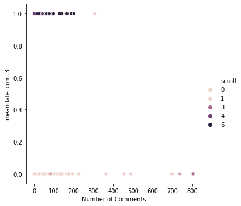


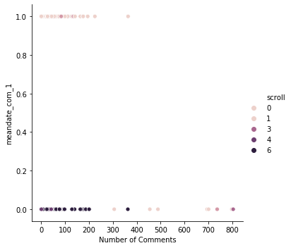


```python
X = spam_percent[['75th Comment Date', 'Number of Comments']]
kmeans = KMeans(n_clusters=4, random_state=0).fit(X)
y_kmeans = kmeans.predict(X)

sns.relplot(x='Number of Comments',y='75th Comment Date',hue='page', data=spam_percent)
plt.show()

plt.scatter(X.iloc[:, 1], X.iloc[:, 0], c=y_kmeans, s=50, cmap=cmap)

centers = kmeans.cluster_centers_
plt.scatter(centers[:, 1], centers[:, 0], c='black', s=200, alpha=0.5)
```


    <matplotlib.collections.PathCollection at 0x7f2b1a509f40>


```python
sns.relplot(x='Number of Comments',y='Mean Comment Date',hue='page', data=spam_percent)

```


```python
sns.relplot(x='Median Comment Date', y='spam',hue='page', data=spam_percent)
```


```python
reviews_scroll = pd.merge(reviews_cleaned,spam_percent[['SKU','scroll']], on='SKU')
pg1 = reviews_scroll[reviews_scroll['scroll'] == 1]['SKU']
pg2 = reviews_scroll[reviews_scroll['scroll'] == 2]['SKU']
pg3 = reviews_scroll[reviews_scroll['scroll'] == 3]['SKU']
pg4 = reviews_scroll[reviews_scroll['scroll'] == 4]['SKU']
pg5 = reviews_scroll[reviews_scroll['scroll'] == 5]['SKU']
sns.distplot(pg1, kde=False)
sns.distplot(pg2, kde=False)
sns.distplot(pg3, kde=False)
sns.distplot(pg4, kde=False)
sns.distplot(pg5, kde=False)
plt.ylabel('Count')
plt.legend(labels=['1', '2','3','4','5'])

```


    <matplotlib.legend.Legend at 0x7f830c6754c0>


```python
pg1 = reviews_scroll[reviews_scroll['scroll'] == 1]['Date (ordinal)']
pg2 = reviews_scroll[reviews_scroll['scroll'] == 2]['Date (ordinal)']
pg3 = reviews_scroll[reviews_scroll['scroll'] == 3]['Date (ordinal)']
pg4 = reviews_scroll[reviews_scroll['scroll'] == 4]['Date (ordinal)']
pg5 = reviews_scroll[reviews_scroll['scroll'] == 5]['Date (ordinal)']
sns.distplot(pg1, kde=False)
sns.distplot(pg2, kde=False)
sns.distplot(pg3, kde=False)
sns.distplot(pg4, kde=False)
sns.distplot(pg5, kde=False)
plt.ylabel('Count')
plt.legend(labels=['1', '2','3','4','5'])
```


    <matplotlib.legend.Legend at 0x7f830c79ca30>


```python
sns.distplot(pg2, kde=False)
sns.distplot(pg3, kde=False)
plt.legend(labels=['2','3'])
```


    <matplotlib.legend.Legend at 0x7f83079acb50>


```python
sns.distplot(pg4, kde=False)
sns.distplot(pg5, kde=False)
plt.legend(labels=['4','5'])
```


    <matplotlib.legend.Legend at 0x7f8307669d60>


```python
X = preprocessing.scale(items_train[top40])
Y = items_train['scroll']

# Split dataset into training set and test set
X_train, X_test, y_train, y_test = train_test_split(X, Y, test_size=0.3) # 70% training and 30% test

lm = LogisticRegression(fit_intercept=True,C=1,penalty='l2',solver='lbfgs')
#lm = LogisticRegression(multi_class='multinomial',solver ='newton-cg').fit(X_train, y_train)
lm.fit(X_train, y_train)

y_pred = lm.predict(X_test)
cv_scores_linreg = cross_val_score(lm,X_train,y_train,scoring='accuracy')

# Model Accuracy, how often is the classifier correct?
print("Testing R^2: {}".format(lm.score(X_test, y_test)))
print("Training R^2: {}".format(lm.score(X_train, y_train)))
rmse = np.sqrt(mean_squared_error(y_test, y_pred))
print("Root Mean Squared Error: {}".format(rmse))
mae = mean_absolute_error(y_test, y_pred)
print("Mean Absolute Error: {}".format(mae))
print("Mean 5-Fold CV Score: {}".format(np.mean(cv_scores_linreg)))
print("5-Fold CV Scores: {}".format(cv_scores_linreg))
print(classification_report(y_test, np.round(y_pred)))

# Model Accuracy: how often is the classifier correct?
print("Accuracy:",metrics.accuracy_score(y_test, y_pred))
# Model Precision: what percentage of positive tuples are labeled as such?
print("Precision:",metrics.precision_score(y_test, y_pred,average='weighted'))

# Model Recall: what percentage of positive tuples are labelled as such?
print("Recall:",metrics.recall_score(y_test, y_pred,average='weighted'))
```

    Testing R^2: 0.5412844036697247
    Training R^2: 0.6692913385826772
    Root Mean Squared Error: 1.0181833075170807
    Mean Absolute Error: 0.6146788990825688
    Mean 5-Fold CV Score: 0.5157647058823529
    5-Fold CV Scores: [0.56862745 0.52941176 0.52941176 0.43137255 0.52      ]
                  precision    recall  f1-score   support
    
               1       0.64      0.70      0.67        30
               2       0.33      0.35      0.34        17
               3       0.40      0.20      0.27        20
               4       0.43      0.43      0.43        23
               5       0.72      0.95      0.82        19
    
        accuracy                           0.54       109
       macro avg       0.50      0.53      0.51       109
    weighted avg       0.52      0.54      0.52       109
    
    Accuracy: 0.5412844036697247
    Precision: 0.5177759243814289
    Recall: 0.5412844036697247


```python
X = preprocessing.scale(items_test[top40])
Y = items_test['scroll']

y_pred = lm.predict(X)
cv_scores_linreg = cross_val_score(lm,X,Y,scoring='accuracy')

# Model Accuracy, how often is the classifier correct?
print("Testing R^2: {}".format(lm.score(X, Y)))
print("Training R^2: {}".format(lm.score(X, Y)))
rmse = np.sqrt(mean_squared_error(Y, y_pred))
print("Root Mean Squared Error: {}".format(rmse))
mae = mean_absolute_error(Y, y_pred)
print("Mean Absolute Error: {}".format(mae))
print("Mean 5-Fold CV Score: {}".format(np.mean(cv_scores_linreg)))
print("5-Fold CV Scores: {}".format(cv_scores_linreg))
print(classification_report(Y, np.round(y_pred)))

# Model Accuracy: how often is the classifier correct?
print("Accuracy:",metrics.accuracy_score(Y, y_pred))
# Model Precision: what percentage of positive tuples are labeled as such?
print("Precision:",metrics.precision_score(Y, y_pred,average='weighted'))

# Model Recall: what percentage of positive tuples are labelled as such?
print("Recall:",metrics.recall_score(Y, y_pred,average='weighted'))
```

    Testing R^2: 0.5164835164835165
    Training R^2: 0.5164835164835165
    Root Mean Squared Error: 1.0690449676496976
    Mean Absolute Error: 0.7032967032967034
    Mean 5-Fold CV Score: 0.5163742690058479
    5-Fold CV Scores: [0.52631579 0.55555556 0.55555556 0.44444444 0.5       ]
                  precision    recall  f1-score   support
    
               1       0.43      0.76      0.55        17
               2       0.27      0.18      0.21        17
               3       0.22      0.10      0.13        21
               4       0.55      0.67      0.60        18
               5       0.89      0.94      0.92        18
    
        accuracy                           0.52        91
       macro avg       0.47      0.53      0.48        91
    weighted avg       0.47      0.52      0.47        91
    
    Accuracy: 0.5164835164835165
    Precision: 0.46805650489861017
    Recall: 0.5164835164835165


```python

```
